# Farm Space Plan

This file is the **human-readable space authority** for the 5.5-hectare Self-Sufficient Eco Farm.

It explains how much space each major farm section receives, what the space contains, which spaces it should touch or avoid, the main utility/drainage needs, and the planning diagrams agents should follow.

## Measurement basis

- Whole site: **250 m × 220 m**
- Total area: **55,000 m²**
- Total area: **≈ 592,016 ft²**
- Total area: **≈ 13.59 acres**
- CAD planning frame: **250,000 mm × 220,000 mm**
- Coordinate origin: south-west corner `(0,0)`
- North: `+Y`; East: `+X`

**Conversion:** `1 m² = 10.7639 ft²`.

> Dimensions in this file are master-planning envelopes. Exact coordinates and construction dimensions remain **PROVISIONAL** until approved by survey/CAD/engineering authorities.

## Whole-farm diagram

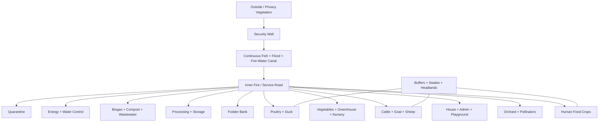

## Area summary

| No. | Farm section | Area m² | Area ft² | Planning dimension / form | Main skill |
|---:|---|---:|---:|---|---|
| 1 | Perimeter Canal | 5,400 | 58,125 | Distributed around perimeter; ~6 m clear-water width | [skill](.agents/skills/eco-farm-perimeter-canal-space/SKILL.md) |
| 2 | Security Wall + Inspection/Privacy Strip | 1,800 | 19,375 | Perimeter strip; ~2.5–3 m inspection width + wall | [skill](.agents/skills/eco-farm-perimeter-wall-security-space/SKILL.md) |
| 3 | Roads + Drains + Fire Lanes + Gates | 4,200 | 45,208 | Network; primary ~5 m, secondary ~3.5 m, fire road ~4.5–5 m | [skill](.agents/skills/eco-farm-roads-gates-traffic-space/SKILL.md) |
| 4 | House + Admin + Playground + Kitchen Garden | 2,200 | 23,681 | Combined clean-family zone | [skill](.agents/skills/eco-farm-house-admin-space/SKILL.md) |
| 5 | Human Food Crops | 6,500 | 69,965 | Planning envelope ~65 m × 100 m | [skill](.agents/skills/eco-farm-food-crop-space/SKILL.md) |
| 6 | Fodder Bank | 12,000 | 129,167 | Planning envelope ~100 m × 120 m | [skill](.agents/skills/eco-farm-fodder-bank-space/SKILL.md) |
| 7 | Vegetables + Greenhouse + Nursery | 4,500 | 48,438 | Planning envelope ~60 m × 75 m | [skill](.agents/skills/eco-farm-vegetable-greenhouse-nursery-space/SKILL.md) |
| 8 | Orchard + Pollinator Zone | 4,500 | 48,438 | Planning envelope ~60 m × 75 m | [skill](.agents/skills/eco-farm-orchard-pollinator-space/SKILL.md) |
| 9 | Cattle + Goat + Sheep District | 3,200 | 34,445 | Planning envelope ~40 m × 80 m | [skill](.agents/skills/eco-farm-ruminant-space/SKILL.md) |
| 10 | Poultry + Duck District | 1,500 | 16,146 | PROVISIONAL envelope ~30 m × 50 m | [skill](.agents/skills/eco-farm-poultry-duck-space/SKILL.md) |
| 11 | Agro-Processing + Storage Hub | 2,800 | 30,139 | Planning envelope ~40 m × 70 m | [skill](.agents/skills/eco-farm-processing-storage-space/SKILL.md) |
| 12 | Biogas + Compost + Wastewater Treatment | 1,600 | 17,222 | Planning envelope ~40 m × 40 m | [skill](.agents/skills/eco-farm-biogas-compost-space/SKILL.md) |
| 13 | Energy + Clean-Water Control | 800 | 8,611 | Planning envelope ~20 m × 40 m | [skill](.agents/skills/eco-farm-energy-water-control-space/SKILL.md) |
| 14 | Quarantine + Emergency Reserve | 1,000 | 10,764 | Planning envelope ~20 m × 50 m | [skill](.agents/skills/eco-farm-quarantine-space/SKILL.md) |
| 15 | Biosecurity Buffers + Headlands + Swales | 3,000 | 32,292 | Distributed/irregular reserve | [skill](.agents/skills/eco-farm-master-planning/SKILL.md) |

**Total: 55,000 m² ≈ 592,016 ft².**

# 1. Perimeter Canal

**Area:** 5,400 m² ≈ 58,125 ft²  
**Form:** Continuous perimeter system, not a rectangular internal block  
**Concept water width:** ~6 m  
**Concept operating depth:** ~1.5–2.0 m  
**Skill:** [`eco-farm-perimeter-canal-space`](.agents/skills/eco-farm-perimeter-canal-space/SKILL.md)

## Purpose
- fish production
- flood/stormwater retention
- irrigation reserve
- fire-water reserve
- security separation

## Required elements
- nursery/hapa section
- grow-out sections
- screened irrigation intake
- fire-water suction points
- overflow/spillway
- fish-escape screens
- aeration/monitoring points
- gate/bridge crossings

## Adjacency
Outside-to-inside sequence: **wall → inspection strip → canal → inner bank → fire/service road**.

## Utilities and drainage
Only controlled clean runoff may enter after sediment/erosion treatment. Human sewage, raw manure, poultry/duck wastewater, processing wastewater, and oily workshop water are prohibited.

## Diagram


---

# 2. Security Wall + Inspection / Privacy Strip

**Area:** 1,800 m² ≈ 19,375 ft²  
**Form:** Distributed perimeter strip  
**Wall height concept:** ~3 m  
**Inspection strip:** ~2.5–3.0 m  
**Skill:** [`eco-farm-perimeter-wall-security-space`](.agents/skills/eco-farm-perimeter-wall-security-space/SKILL.md)

## Purpose
- physical security
- privacy
- patrol/maintenance
- CCTV/light mounting interfaces
- protection of farm operations from outside access

## Required elements
- legal boundary control
- wall/gate piers
- patrol strip
- privacy vegetation
- CCTV coverage
- security lighting
- maintenance access
- drainage away from footing

## Prohibited conflicts
- canal bank must not undermine the wall foundation
- large roots must not damage wall/footing
- drain outlets must not erode the footing

## Diagram


---

# 3. Roads + Drains + Fire Lanes + Gates

**Area:** 4,200 m² ≈ 45,208 ft²  
**Form:** Distributed circulation network  
**Primary road:** ~5.0 m  
**Secondary road:** ~3.5 m  
**Fire/service road:** ~4.5–5.0 m  
**Pedestrian path:** ~1.2–1.5 m  
**Main gate:** ~6 m clear concept  
**Service/emergency gate:** ~5 m clear concept  
**Skill:** [`eco-farm-roads-gates-traffic-space`](.agents/skills/eco-farm-roads-gates-traffic-space/SKILL.md)

## Traffic systems
- **Clean:** main gate → house/admin → crops → packhouse/cold store
- **Dirty/service:** service gate → animals → manure → biogas/compost → workshop
- **Heavy machinery:** service gate → garage/workshop → fields → processing hub
- **Emergency:** either gate → fire road → all critical zones

## Rules
- no tractor/truck route through playground
- manure traffic cannot use the clean packhouse loading route
- drains follow road/service corridors where practical
- turning areas must fit actual tractors/trailers/fire vehicles

## Diagram

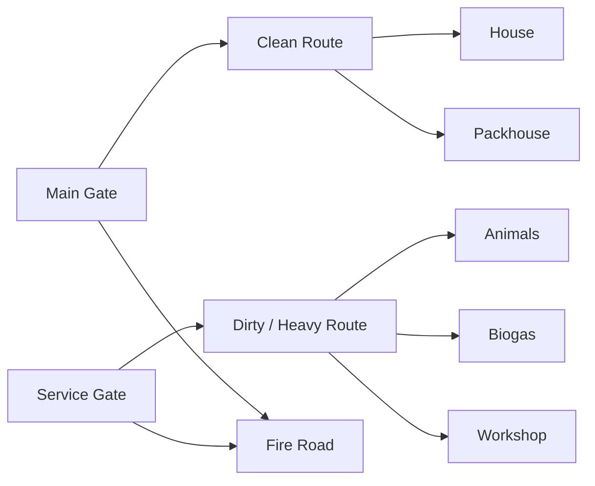

---

# 4. House + Admin + Playground + Kitchen Garden

**Combined area:** 2,200 m² ≈ 23,681 ft²  
**Skill:** [`eco-farm-house-admin-space`](.agents/skills/eco-farm-house-admin-space/SKILL.md)

## Internal space schedule

| Component | Planning dimension | Area m² | Area ft² |
|---|---:|---:|---:|
| House/admin building envelope | ~24 m × 20 m | ~480 | ~5,167 |
| Playground | 20 m × 30 m | 600 | 6,458 |
| Kitchen/herb garden | 10 m × 20 m | 200 | 2,153 |
| Parking, paths, admin yard, green/safety buffer | distributed | ~920 | ~9,903 |
| **Total** |  | **2,200** | **23,681** |

## House/admin functions
- residence
- office
- CCTV/NVR control
- communications
- first aid
- clean visitor reception
- emergency shelter
- household parking

## Playground
See [`eco-farm-playground-space`](.agents/skills/eco-farm-playground-space/SKILL.md). It must be away from canal edge, biogas, quarantine, chemicals, and heavy traffic.

## Diagram

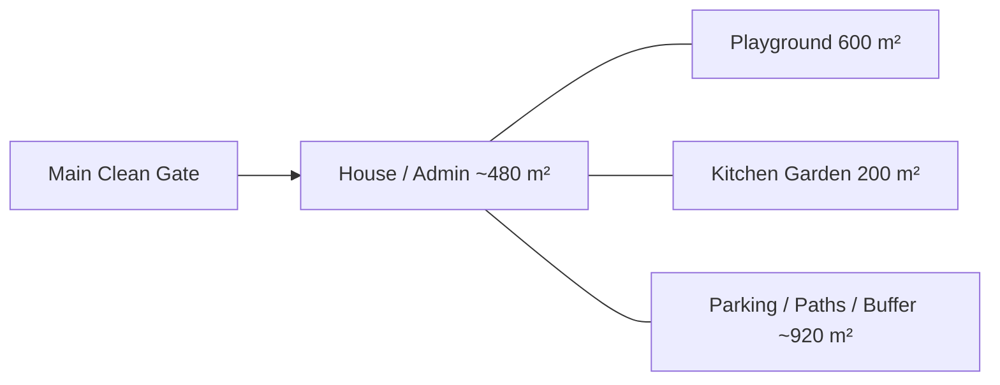

---

# 5. Human Food Crop Zone

**Area:** 6,500 m² ≈ 69,965 ft²  
**Planning envelope:** ~65 m × 100 m = 6,500 m²  
**Approx. dimensions:** ~213 ft × 328 ft  
**Skill:** [`eco-farm-food-crop-space`](.agents/skills/eco-farm-food-crop-space/SKILL.md)

## Planning split

| Crop | Area m² | Area ft² |
|---|---:|---:|
| Rice | ~3,000 | ~32,292 |
| Maize | ~1,500 | ~16,146 |
| Pulses/legumes | ~1,000 | ~10,764 |
| Mustard/sesame | ~1,000 | ~10,764 |

Rotations may change the seasonal sub-area.

## Rules
- no tall trees/buildings in the solar envelope
- maintain irrigation and machinery access
- field runoff enters canal only after silt/erosion control
- no raw animal or human wastewater

## Diagram

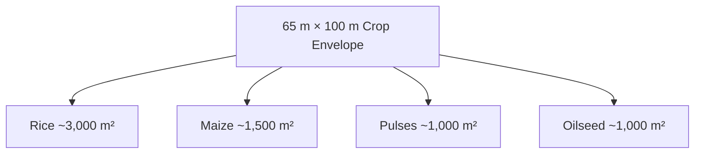

---

# 6. Fodder Bank

**Area:** 12,000 m² ≈ 129,167 ft²  
**Planning envelope:** ~100 m × 120 m  
**Approx. dimensions:** ~328 ft × 394 ft  
**Skill:** [`eco-farm-fodder-bank-space`](.agents/skills/eco-farm-fodder-bank-space/SKILL.md)

This is the **largest internal productive block**.

## Planning split

| Fodder | Area m² | Approx. ft² |
|---|---:|---:|
| Napier | 5,500–6,000 | 59,202–64,583 |
| Fodder maize/sorghum | 2,500–3,000 | 26,910–32,292 |
| Legume forage | 1,500–2,000 | 16,146–21,528 |
| Seasonal fodder, controlled azolla/duckweed, seed/access/headlands | balance | balance |

## Rules
- staggered harvest blocks
- cart/machine lanes
- irrigation + drainage
- short route to silage and ruminants
- annual dry-matter measurement controls animal expansion

## Diagram

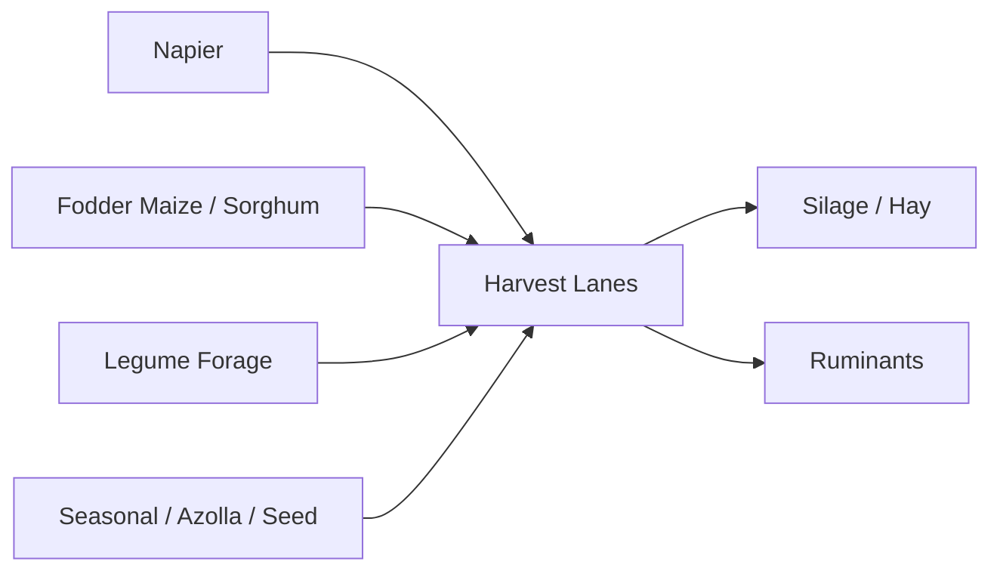

---

# 7. Vegetables + Greenhouse + Nursery

**Area:** 4,500 m² ≈ 48,438 ft²  
**Planning envelope:** ~60 m × 75 m  
**Approx. dimensions:** ~197 ft × 246 ft  
**Skill:** [`eco-farm-vegetable-greenhouse-nursery-space`](.agents/skills/eco-farm-vegetable-greenhouse-nursery-space/SKILL.md)

## Planning split

| Component | Area m² | Area ft² |
|---|---:|---:|
| Open rotation beds | 2,500–3,000 | 26,910–32,292 |
| Greenhouse/protected crop | 700–1,000 | 7,535–10,764 |
| Nursery/mother plants | 250–350 | 2,691–3,767 |
| Wash point, paths, drains, service | balance | balance |

## Greenhouse concept
Example modules: **10 m × 30 m** or **12 m × 24 m**; ridge height ~4–5 m concept.

## Rules
- clean access only
- no manure traffic
- no raw slurry irrigation
- crop rotation and disease separation
- nursery hygiene

## Diagram

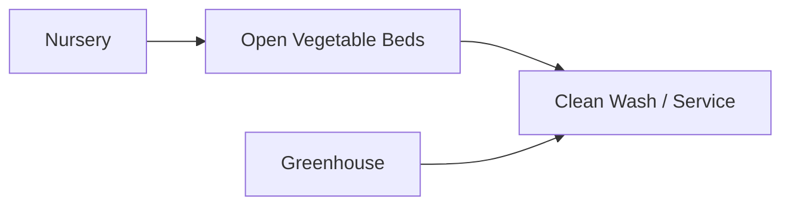

---

# 8. Orchard + Pollinator Zone

**Area:** 4,500 m² ≈ 48,438 ft²  
**Planning envelope:** ~60 m × 75 m  
**Approx. dimensions:** ~197 ft × 246 ft  
**Skill:** [`eco-farm-orchard-pollinator-space`](.agents/skills/eco-farm-orchard-pollinator-space/SKILL.md)

## Planning split

| Component | Area m² | Area ft² |
|---|---:|---:|
| Mango | ~1,500 | ~16,146 |
| Guava | ~750 | ~8,073 |
| Citrus/lemon | ~750 | ~8,073 |
| Banana/papaya | ~1,000 | ~10,764 |
| Bees/flowers/paths/drains | ~500 | ~5,382 |

## Rules
- calculate mature canopy, not sapling size
- tallest trees kept away from crop sunlight edge
- cyclone pruning and fall-risk management
- beehives away from playground/main family path

## Diagram

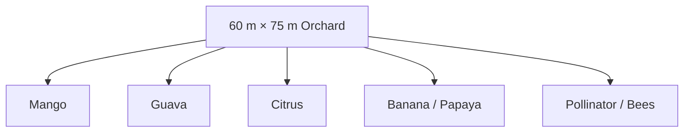

---

# 9. Cattle + Goat + Sheep District

**Area:** 3,200 m² ≈ 34,445 ft²  
**Planning envelope:** ~40 m × 80 m  
**Approx. dimensions:** ~131 ft × 262 ft  
**Skill:** [`eco-farm-ruminant-space`](.agents/skills/eco-farm-ruminant-space/SKILL.md)

## Base herd
- cattle: 6–8
- goats: 12–16
- sheep: 6–8

## Internal planning

| Component | Area m² | Area ft² |
|---|---:|---:|
| Cattle shed | 350–450 | 3,767–4,844 |
| Cattle yard | 500–700 | 5,382–7,535 |
| Goat/sheep area | 300–400 | 3,229–4,306 |
| Maternity/calf/isolation | 250–350 | 2,691–3,767 |
| Feed lanes, manure lanes, circulation, buffers | balance | balance |

## Flow
Feed enters on clean side. Manure leaves on dirty side toward biogas. Animal/waste traffic never crosses playground/clean packhouse routes.

## Diagram

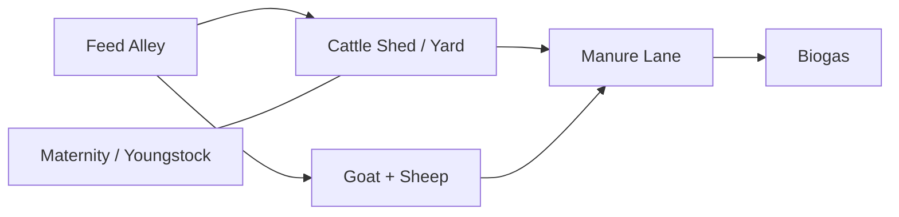

---

# 10. Poultry + Duck District

**Area:** 1,500 m² ≈ 16,146 ft²  
**PROVISIONAL envelope:** ~30 m × 50 m  
**Approx. dimensions:** ~98 ft × 164 ft  
**Skill:** [`eco-farm-poultry-duck-space`](.agents/skills/eco-farm-poultry-duck-space/SKILL.md)

## Base capacity
- layers: 120–150
- broilers: 80–120 per batch
- ducks: 60–80

## Internal concept

| Component | Area m² | Area ft² |
|---|---:|---:|
| Layer house | 180 | 1,938 |
| Broiler house | 120 | 1,292 |
| Duck house | 120 | 1,292 |
| Duck wet/service yards | 300–400 | 3,229–4,306 |
| Feed, egg handling, isolation, circulation, buffers | balance | balance |

## Rules
- layer, broiler, duck physically separated
- duck wet area is not a fish pond
- wastewater goes to treatment
- egg collection uses clean route

## Diagram

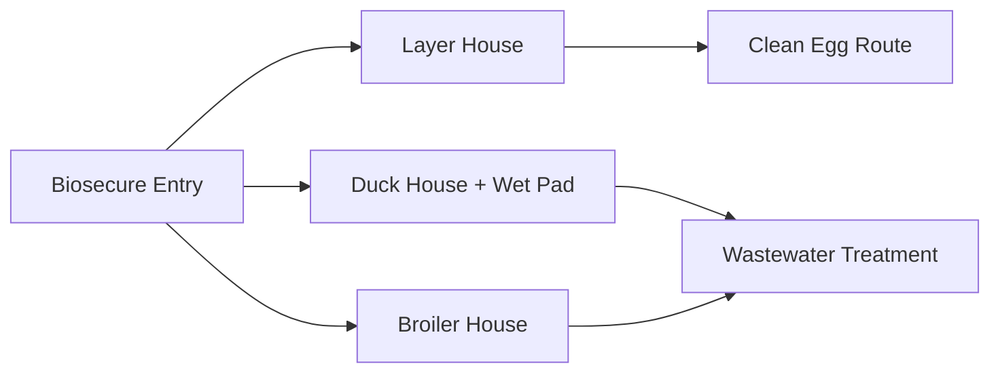

---

# 11. Agro-Processing + Storage Hub

**Area:** 2,800 m² ≈ 30,139 ft²  
**Planning envelope:** ~40 m × 70 m  
**Approx. dimensions:** ~131 ft × 230 ft  
**Skill:** [`eco-farm-processing-storage-space`](.agents/skills/eco-farm-processing-storage-space/SKILL.md)

## Internal schedule

| Facility | Area m² | Approx. ft² |
|---|---:|---:|
| Crop receiving/weighing | 150–200 | 1,615–2,153 |
| Covered drying | 200–250 | 2,153–2,691 |
| Solar dryer | 50–80 | 538–861 |
| Grain store | 350–450 | 3,767–4,844 |
| Rice mill | 180–250 | 1,938–2,691 |
| Feed mill | 250–300 | 2,691–3,229 |
| Oil press | 80–120 | 861–1,292 |
| Seed bank | 80–100 | 861–1,076 |
| Cold room + packhouse | 250–350 | 2,691–3,767 |
| Milk/egg/fish clean handling | 150–200 | 1,615–2,153 |
| Workshop + spares | 250–300 | 2,691–3,229 |
| Silage/hay/feed logistics | 250–350 | 2,691–3,767 |

## Separation
Dusty milling, clean food handling, wet processing, cold rooms, hot-work workshop, and dry fire-load storage must be separated.

## Diagram

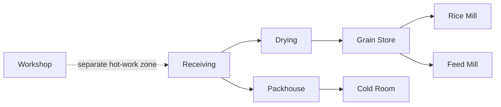

---

# 12. Biogas + Compost + Wastewater Treatment

**Area:** 1,600 m² ≈ 17,222 ft²  
**Planning envelope:** ~40 m × 40 m  
**Approx. dimensions:** ~131 ft × 131 ft  
**Skills:** [biogas/compost](.agents/skills/eco-farm-biogas-compost-space/SKILL.md) · [wastewater](.agents/skills/eco-farm-wastewater-treatment-space/SKILL.md)

## Internal concept

| Component | Area m² | Area ft² |
|---|---:|---:|
| Digester/equipment | 250–350 | 2,691–3,767 |
| Solids/equalization | ~200 | ~2,153 |
| Compost | 400–500 | 4,306–5,382 |
| Wastewater treatment | 250–350 | 2,691–3,767 |
| Service/buffer | balance | balance |

## Flow

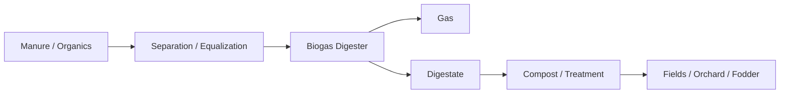

## Rules
- no untreated slurry to canal
- gas kept away from ignition
- compost leachate contained
- treated nutrient application follows soil/nutrient tests

---

# 13. Energy + Clean-Water Control

**Area:** 800 m² ≈ 8,611 ft²  
**Planning envelope:** ~20 m × 40 m  
**Approx. dimensions:** ~66 ft × 131 ft  
**Skills:** [energy/water control](.agents/skills/eco-farm-energy-water-control-space/SKILL.md) · [water treatment](.agents/skills/eco-farm-water-treatment-space/SKILL.md) · [electrical/CCTV](.agents/skills/eco-farm-electrical-lighting-cctv/SKILL.md)

## Internal concept

| Component | Area m² | Area ft² |
|---|---:|---:|
| Battery/inverter | ~150 | ~1,615 |
| Water treatment | ~150 | ~1,615 |
| Pump/control | ~100 | ~1,076 |
| Storage/utility | ~100 | ~1,076 |
| Service/fire/buffer | balance | balance |

## Energy concept
- rooftop solar: 120–160 kWp concept
- usable battery: 300–500 kWh concept
- biogas generator: 25–40 kW concept

## Rules
- above flood level
- electrical and wet-process rooms physically separated
- restricted access
- critical power and monitoring
- emergency isolation

## Diagram

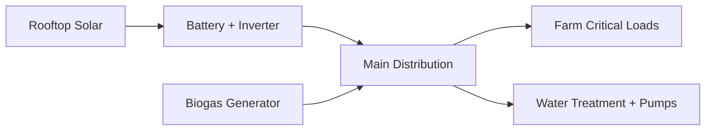

---

# 14. Quarantine + Emergency Reserve

**Area:** 1,000 m² ≈ 10,764 ft²  
**Planning envelope:** ~20 m × 50 m  
**Approx. dimensions:** ~66 ft × 164 ft  
**Skill:** [`eco-farm-quarantine-space`](.agents/skills/eco-farm-quarantine-space/SKILL.md)

## Required functions
- independent animal unloading
- isolation pens
- examination/handling
- dedicated tools
- feed/water
- separate drainage
- boot/vehicle disinfection
- emergency temporary storage

## Rule
New or suspect animals do not enter the main livestock/poultry population until cleared.

## Diagram


---

# 15. Biosecurity Buffers + Headlands + Swales

**Area:** 3,000 m² ≈ 32,292 ft²  
**Form:** Distributed and irregular  
**Skill:** [`eco-farm-master-planning`](.agents/skills/eco-farm-master-planning/SKILL.md)

This allocation is deliberately not one rectangle. It is spread through the farm to keep incompatible zones apart and provide operational room.

## Uses
- biosecurity setbacks
- equipment headlands
- turning space
- vegetated swales
- fire breaks
- building-to-crop separation
- tree-shadow separation
- maintenance access
- utility corridors where approved

## Diagram


---

# 16. Playground Detail

Although the playground is inside the 2,200 m² house/admin allocation, it is a fixed planning component.

**Size:** 20 m × 30 m = **600 m² ≈ 6,458 ft²**  
**Skill:** [`eco-farm-playground-space`](.agents/skills/eco-farm-playground-space/SKILL.md)

```text
30 m / 98.4 ft
┌──────────────────────────────────────┐
│                                      │
│        PLAY / MINI FOOTBALL          │ 20 m / 65.6 ft
│        BADMINTON / EXERCISE          │
│                                      │
├──────── Shade / Seating ─────────────┤
└──────────────────────────────────────┘
```

Must remain away from canal edges, biogas, workshop traffic, quarantine, chemicals, and manure routes.

---

# 17. Space Interaction Diagram

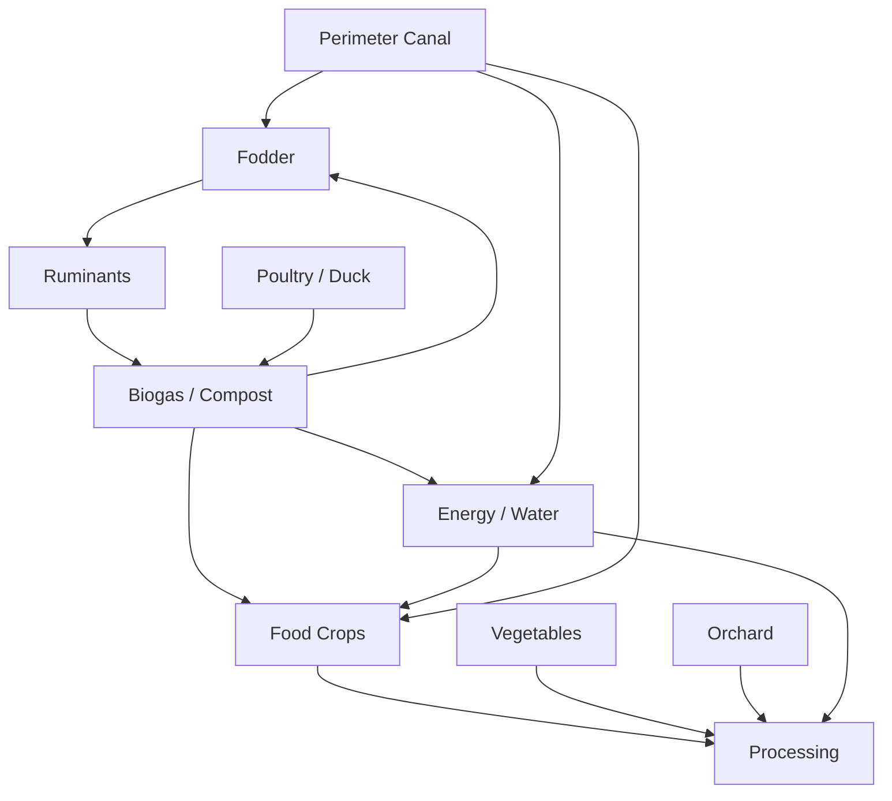

# 18. Space Rules That Apply Everywhere

1. Every zone must remain inside the 250 m × 220 m planning boundary.
2. Space totals must reconcile to 55,000 m².
3. Exact X/Y coordinates must come from the approved coordinate registry/CAD plan.
4. A photorealistic image cannot change the space authority.
5. Tall trees cannot shade critical crop areas.
6. Raw human/animal/industrial wastewater cannot enter the canal.
7. Clean food routes and dirty/manure routes cannot cross casually.
8. Emergency access must remain continuous.
9. Animal expansion requires feed, water, waste, energy, labor and health capacity.
10. Utilities should follow service/road corridors where practical.
11. Flood-sensitive electrical/control/storage equipment stays above design flood level.
12. Any proposed space change must be recorded in `docs/DECISIONS.md` and rechecked with `eco-farm-quality-gate`.

# 19. Next Precision Step

This file defines **area and planning envelopes**, not final coordinates. The next L1 spatial task is to create the approved coordinate registry with:
- every zone polygon `(X,Y)`
- road centerlines/edges
- gate coordinates
- wall/canal/bank lines
- building footprints
- utility corridors
- drain/swale routes
- tree rows/canopy exclusion lines
- north arrow and survey levels

Only after that should agents claim centimeter- or millimeter-accurate placement.
