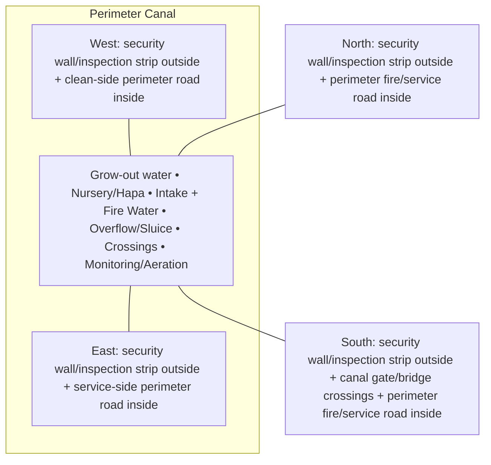

# Perimeter Canal — Architecture

## Architectural intent

Hydraulic/security ring first, aquaculture system second. The canal must remain continuous except engineered crossings.

## Parent space authority

- **Area:** 5,400 m² / 58,125 ft²
- **Geometry:** continuous ring, planning water width about 5.996 m between the security band and perimeter fire/service road
- **L1 authority:** outer canal control at ~1.931 m inset; inner canal control at ~7.927 m inset
- **Status:** parent placement is PROVISIONAL L1; internal partitions/coordinates remain PROVISIONAL until approved in a detailed plan

## Four-side context

| Side | What is beside this space |
|---|---|
| North | security wall/inspection strip outside + perimeter fire/service road inside |
| South | security wall/inspection strip outside + canal gate/bridge crossings + perimeter fire/service road inside |
| East | security wall/inspection strip outside + service-side perimeter road inside |
| West | security wall/inspection strip outside + clean-side perimeter road inside |

## Internal architectural area schedule

The following is the current **non-overlapping internal planning budget**. It sums to the full parent area.

| Section / part | Area m² | Area ft² | Architectural purpose |
|---|---:|---:|---|
| Grow-out fish sections | 3,600 | 38,750 | main fish-production water |
| Nursery / hapa management sections | 500 | 5,382 | fingerling/nursery control |
| Irrigation + fire-water intake sections | 300 | 3,229 | screened withdrawal/fire suction |
| Overflow / spillway / sluice section | 250 | 2,691 | hydraulic control |
| Bridge/crossing influence sections | 300 | 3,229 | approved access crossings |
| Aeration / monitoring / maintenance sections | 450 | 4,844 | water-quality and service points |
| **Total** | **5,400** | **58,125** | **parent space** |

## Architectural organization

1. **Grow-out water**
2. **Nursery/Hapa**
3. **Intake + Fire Water**
4. **Overflow/Sluice**
5. **Crossings**
6. **Monitoring/Aeration**

## Simple architecture diagram — not to scale

## Architecture rules

- All internal parts must fit inside the parent area; no "free" uncounted space.
- Access, drainage, maintenance, fire/biosecurity separation and utility clearances are part of architecture.
- Four-side neighboring context must stay correct in drawings and images.
- Permanent architecture must not move simply to improve an image composition.
- Structural dimensions, foundations, exact room/equipment positions and code-required clearances remain subject to L2/L3 engineering.

## Related files

- [Space & Coordinates](SPACE.md)
- [Blueprint](BLUEPRINT.md)
- [Design](DESIGN.md)
- [Image](IMAGE.md)
- [Drainage](DRAINAGE.md)
- [Water](WATER_SYSTEM.md)
- [Electrical](ELECTRICAL.md)
- [CCTV/Security](CCTV_SECURITY.md)
- [Lighting](LIGHTING.md)
- [Safety](SAFETY.md)
