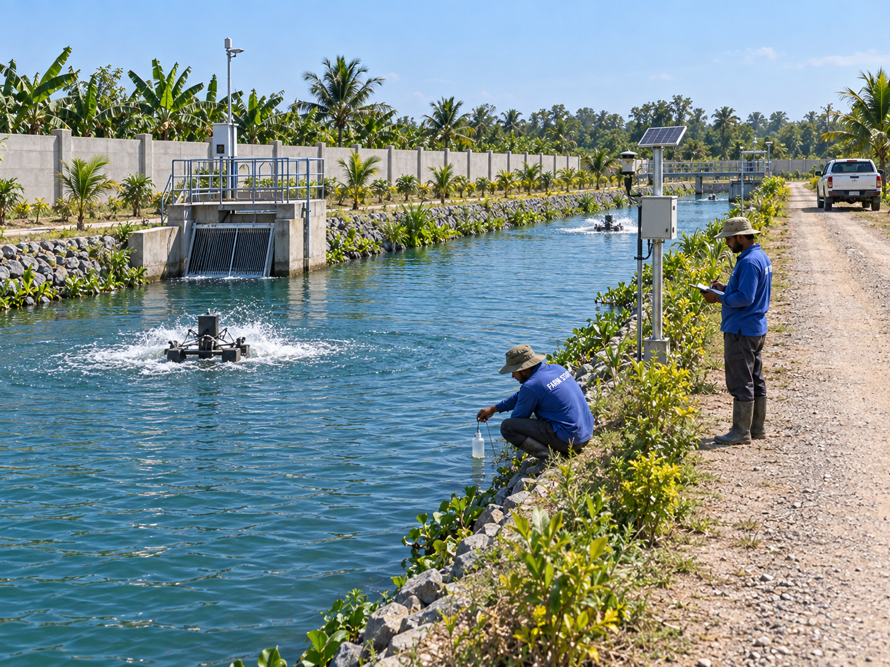
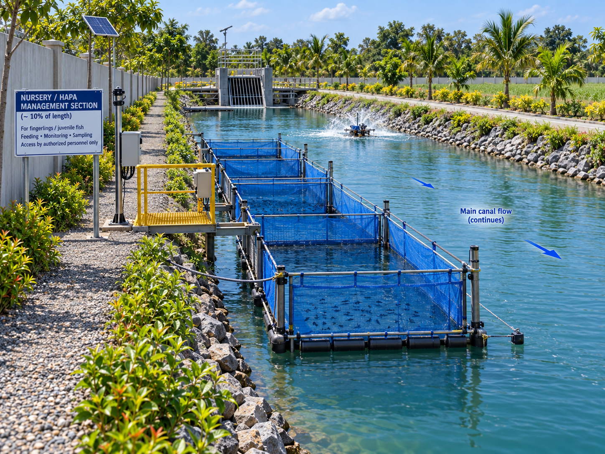
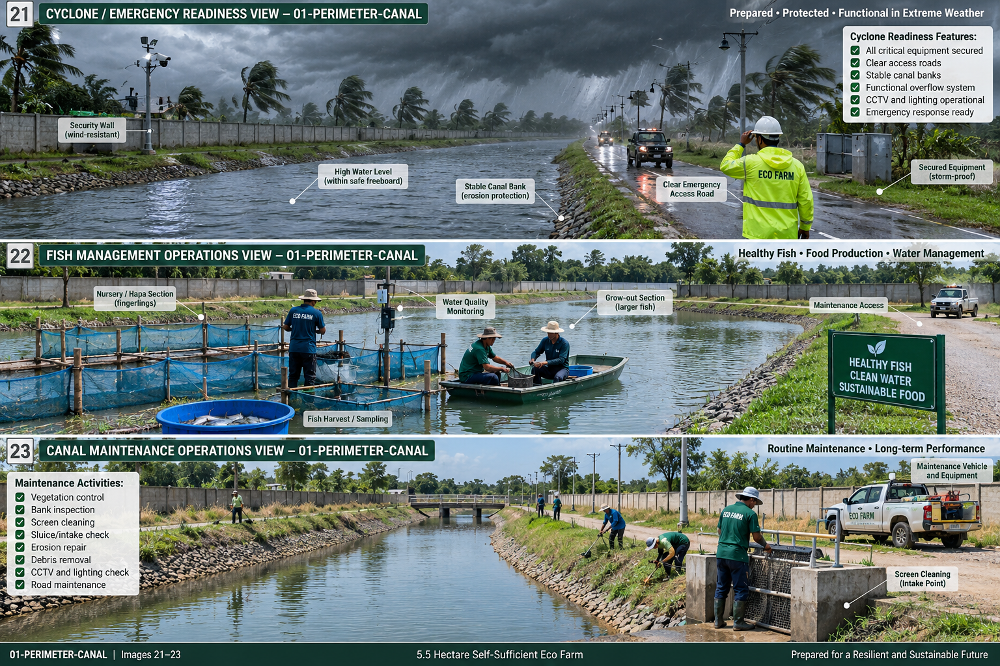
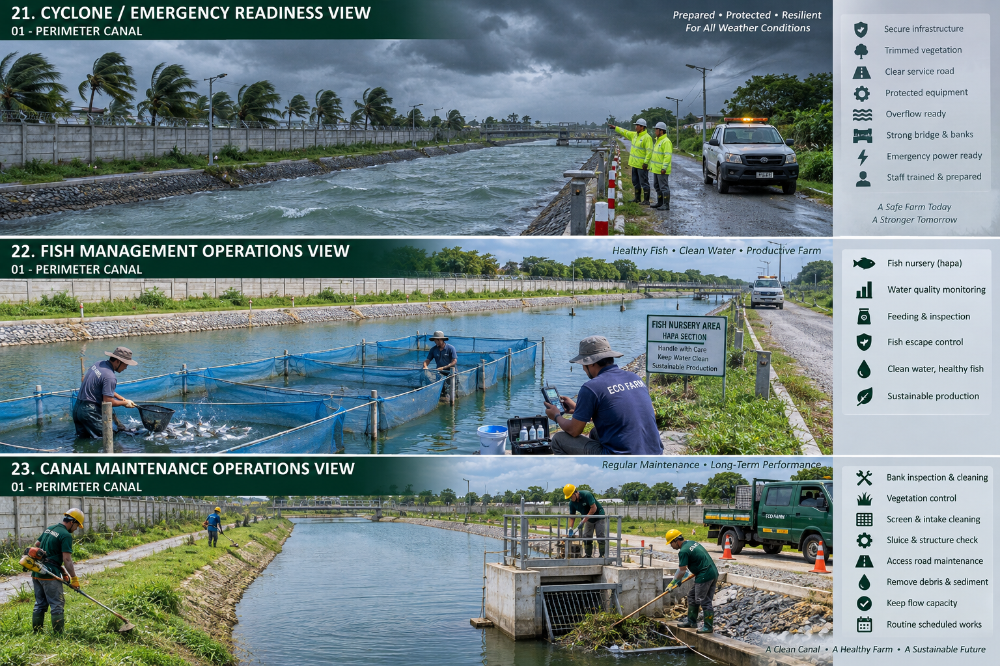
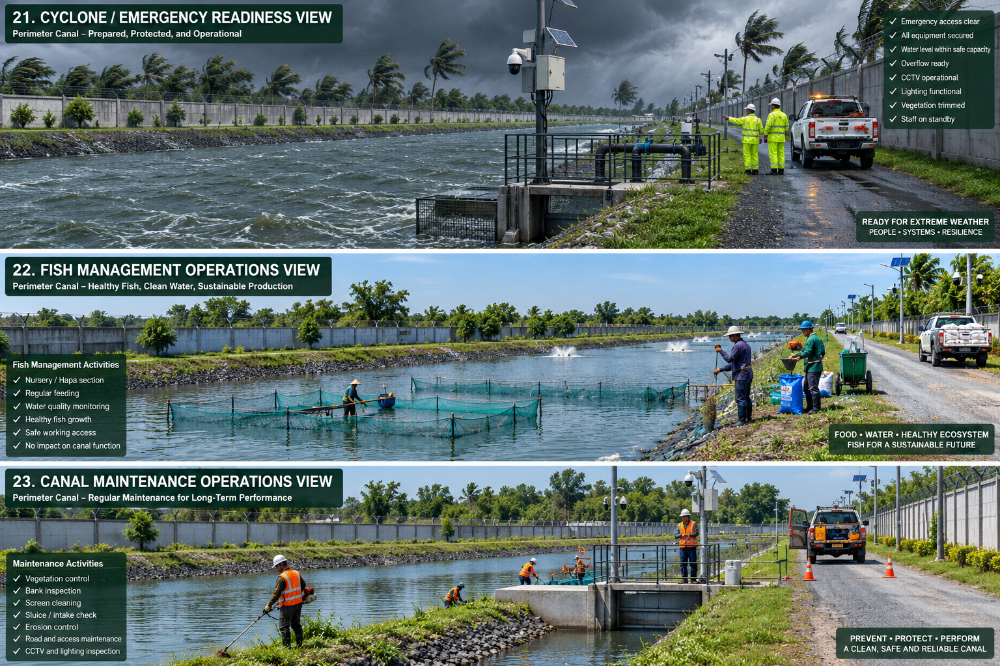

# Perimeter Canal — Operations

## Routine activities

- check water level and screens
- monitor DO/pH/ammonia/temperature/salinity
- inspect banks and crossings
- maintain overflow and fire-water points

## Daily / shift checks

- safety/access clear
- water/power/drainage normal
- obvious leak, damage, pest, disease or contamination check
- abnormal condition logged and escalated

## Weekly checks

- inspect drains, paths and utility points
- inspect stored materials/equipment
- verify cleaning/housekeeping
- review zone-specific records

## Monthly checks

- compare KPI/output against plan
- inspect structural/weather damage
- test emergency/backup function relevant to the space
- verify no neighboring zone has encroached into the area budget

## Seasonal / annual checks

- pre-monsoon drainage and flood preparation
- cyclone/high-wind readiness
- annual area/layout audit
- maintenance/replacement plan
- capacity review before expansion

## Records

Keep date, responsible person, measured value/event, action taken and follow-up due date.

## Operations visual references

### Routine working view

### Nursery operations

### Special operations composites

The three composite images are presentation references. Individual operational procedures remain defined by this file and the engineering/system documents.
