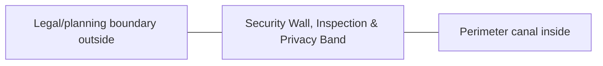

# Security Wall, Inspection & Privacy Band — Architecture

## Architectural intent

The wall is the outer hard-security line. Low/medium privacy planting fits inside the allocation; tall trees are limited to approved non-shading edges or extra land.

## L1 placement

Plot edge to inner control at 1.931 m average gross inset. Local service/CCTV bays may widen.

## Adjacency

- Legal/planning boundary outside
- Perimeter canal inside
- Main and service gate systems

## Spaces / functions inside this zone

- physical security
- privacy
- inspection/patrol
- CCTV/light support
- boundary maintenance

## Architecture rules

- Keep the parent area at **1,800 m²**.
- Preserve clean/dirty traffic separation appropriate to this zone.
- Reserve maintenance and emergency access before adding decorative elements.
- Building footprints, internal partitions and exact equipment positions are **PROVISIONAL** until L2/L3 design.
- Any structure must respect flood, cyclone, fire, biosecurity and drainage requirements.

## Section relationship

## Cross references

- [Space budget](SPACE.md)
- [Design rules](DESIGN.md)
- [Utilities](UTILITIES.md)
- [Image rules](IMAGE.md)
