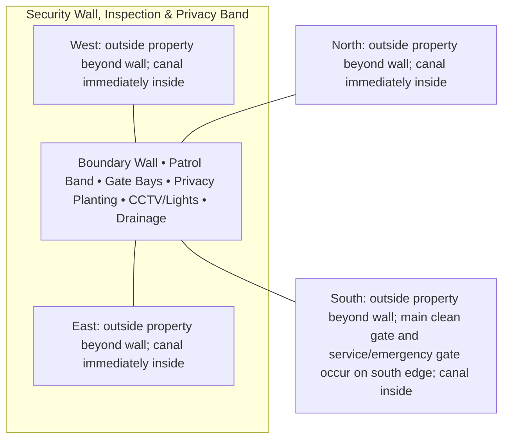
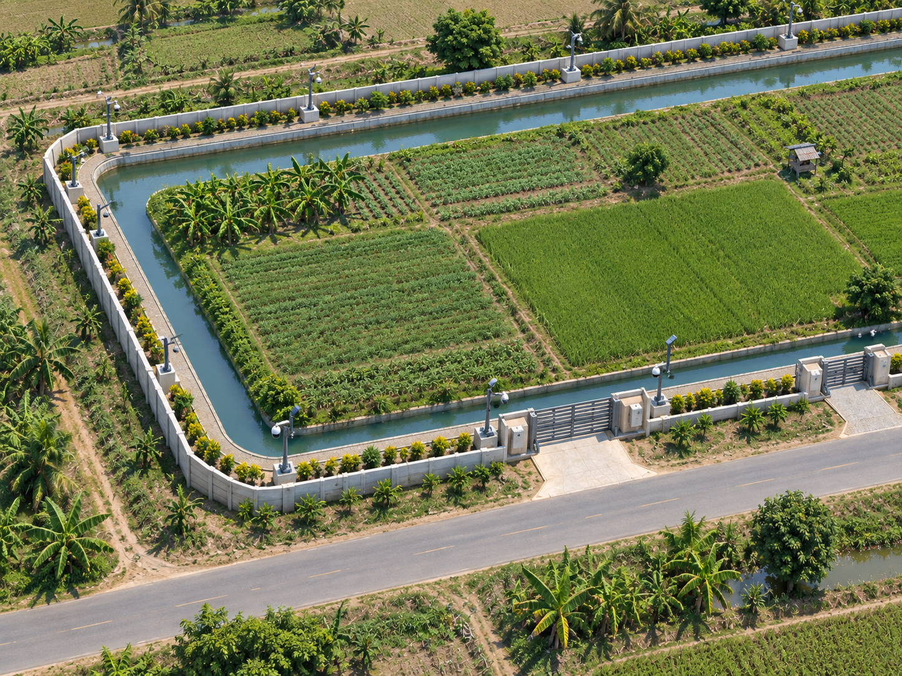
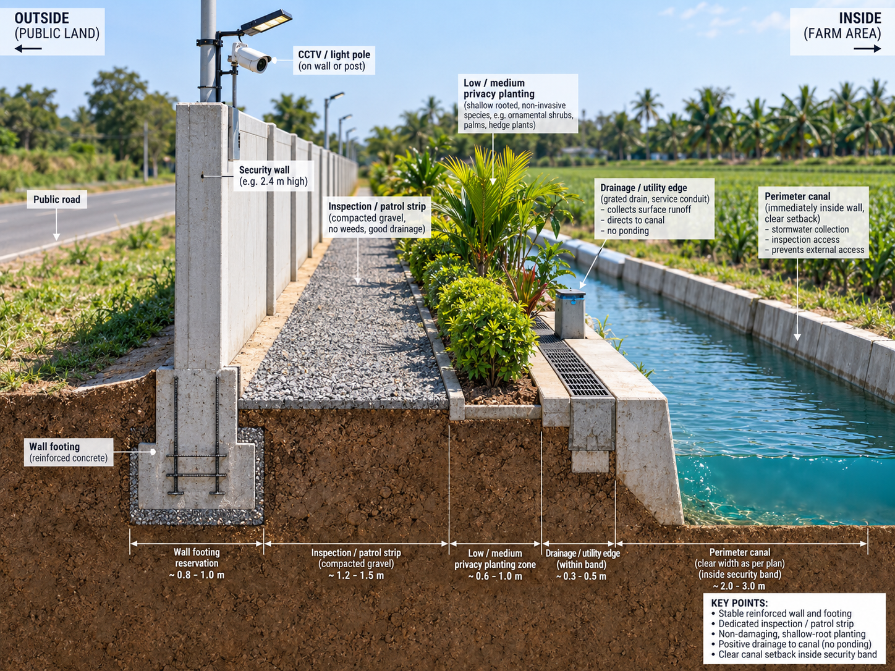

# Security Wall, Inspection & Privacy Band — Architecture

## Architectural intent

Outer hard-security line with maintainable inspection access; canal must stay inside the wall.

## Parent space authority

- **Area:** 1,800 m² / 19,375 ft²
- **Geometry:** continuous outer perimeter security band, equivalent average gross width about 1.931 m with local wider bays
- **L1 authority:** legal/planning boundary to inner security control line at ~1.931 m inset
- **Status:** parent placement is PROVISIONAL L1; internal partitions/coordinates remain PROVISIONAL until approved in a detailed plan

## Four-side context

| Side | What is beside this space |
|---|---|
| North | outside property beyond wall; canal immediately inside |
| South | outside property beyond wall; main clean gate and service/emergency gate occur on south edge; canal inside |
| East | outside property beyond wall; canal immediately inside |
| West | outside property beyond wall; canal immediately inside |

## Internal architectural area schedule

The following is the current **non-overlapping internal planning budget**. It sums to the full parent area.

| Section / part | Area m² | Area ft² | Architectural purpose |
|---|---:|---:|---|
| Wall / footing reservation | 400 | 4,306 | hard perimeter security line |
| Inspection / patrol clear band | 650 | 6,997 | maintenance and patrol |
| Gate / security service bays | 250 | 2,691 | gate piers, control and access |
| Low/medium privacy planting | 300 | 3,229 | privacy without major crop shading |
| CCTV / lighting service pockets | 100 | 1,076 | security equipment clearances |
| Drainage / utility edge | 100 | 1,076 | wall-footing drainage and services |
| **Total** | **1,800** | **19,375** | **parent space** |

## Architectural organization

1. **Boundary Wall**
2. **Patrol Band**
3. **Gate Bays**
4. **Privacy Planting**
5. **CCTV/Lights**
6. **Drainage**

## Simple architecture diagram — not to scale

## Architecture rules

- All internal parts must fit inside the parent area; no "free" uncounted space.
- Access, drainage, maintenance, fire/biosecurity separation and utility clearances are part of architecture.
- Four-side neighboring context must stay correct in drawings and images.
- Permanent architecture must not move simply to improve an image composition.
- Structural dimensions, foundations, exact room/equipment positions and code-required clearances remain subject to L2/L3 engineering.

## Related files

- [Space & Coordinates](SPACE.md)
- [Blueprint](BLUEPRINT.md)
- [Design](DESIGN.md)
- [Image](IMAGE.md)
- [Drainage](DRAINAGE.md)
- [Water](WATER_SYSTEM.md)
- [Electrical](ELECTRICAL.md)
- [CCTV/Security](CCTV_SECURITY.md)
- [Lighting](LIGHTING.md)
- [Safety](SAFETY.md)

## Architectural visual references

### Whole-space aerial relationship

### Wall / footing / drainage character

