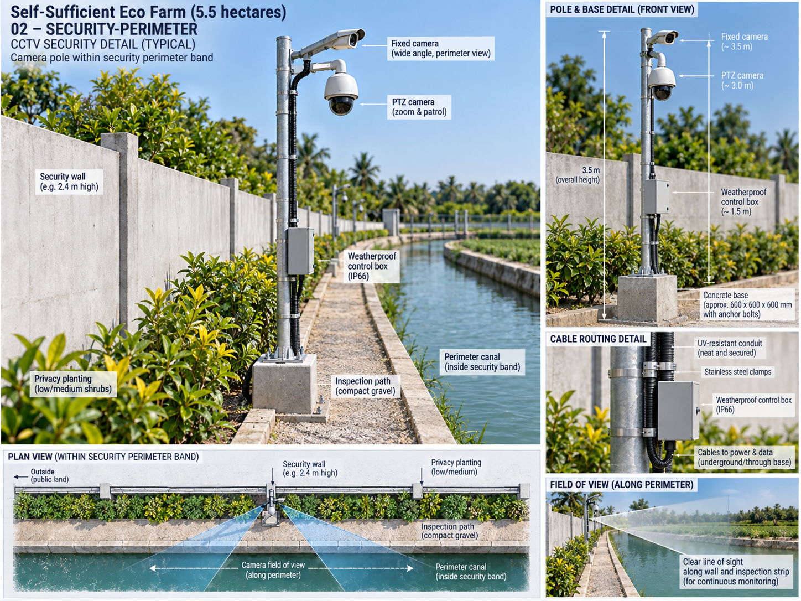
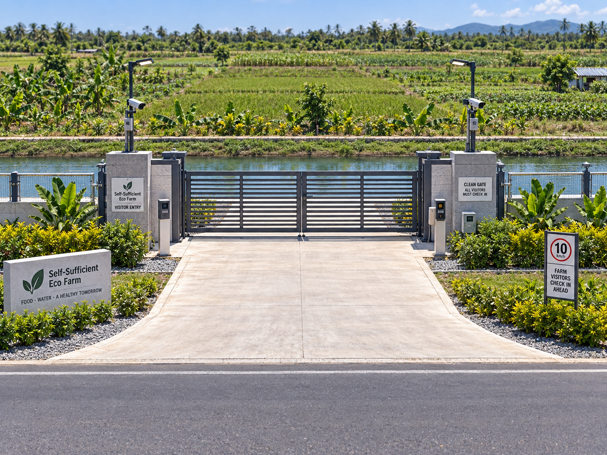
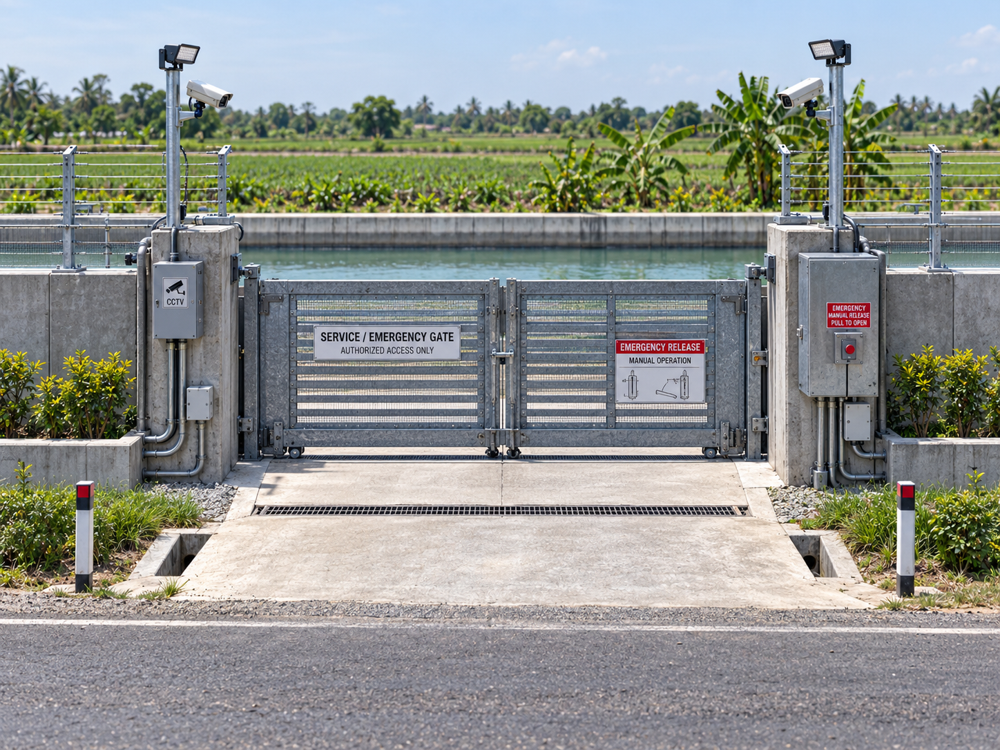
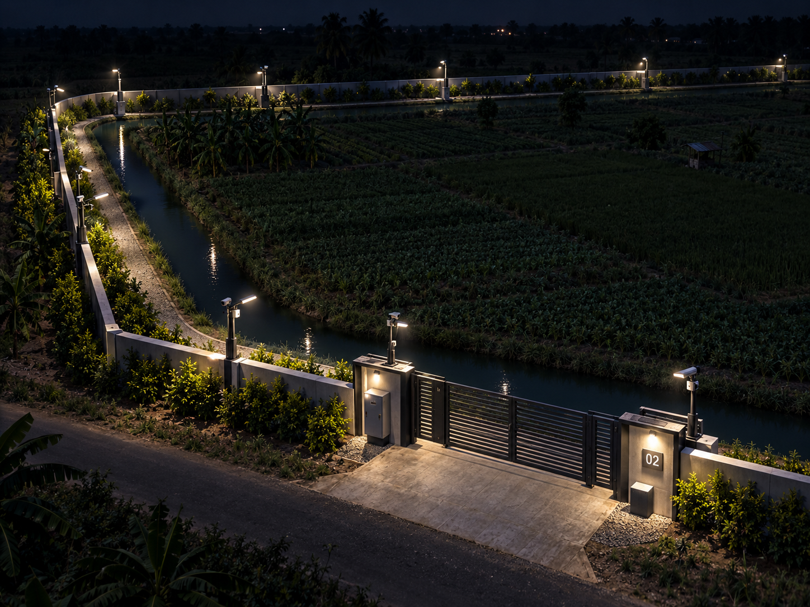

# Security Wall, Inspection & Privacy Band — CCTV & Security

## Purpose
This document defines the cctv & security requirements for this specific farm space. It must be read with `SPACE.md`, `DESIGN.md`, `UTILITIES.md`, `IMAGE.md`, the L1 coordinate plan, and the relevant skills.

## Required / planned elements
- corner coverage, gates, blind sections, canal crossings
- overlapping fields of view at gates
- central recording at admin with backed network/power

## Integration rules
- stay inside the parent land allocation and L1 topology
- do not export hazards or drainage problems into neighboring zones
- keep clean, dirty, wet, electrical and public/service interfaces separated as appropriate
- provide maintenance access
- mark exact unengineered sizes/ratings/coordinates PROVISIONAL
- coordinate with farm-wide systems before construction

## Drawing / image requirement
Any blueprint or image that represents this system must show its route, equipment/space, access and neighbor interfaces consistently across angles.

## Engineering boundary
Final structural, hydraulic, electrical, fire, public-health, veterinary or other regulated values require qualified design/approval where applicable.

## CCTV / security visual references

