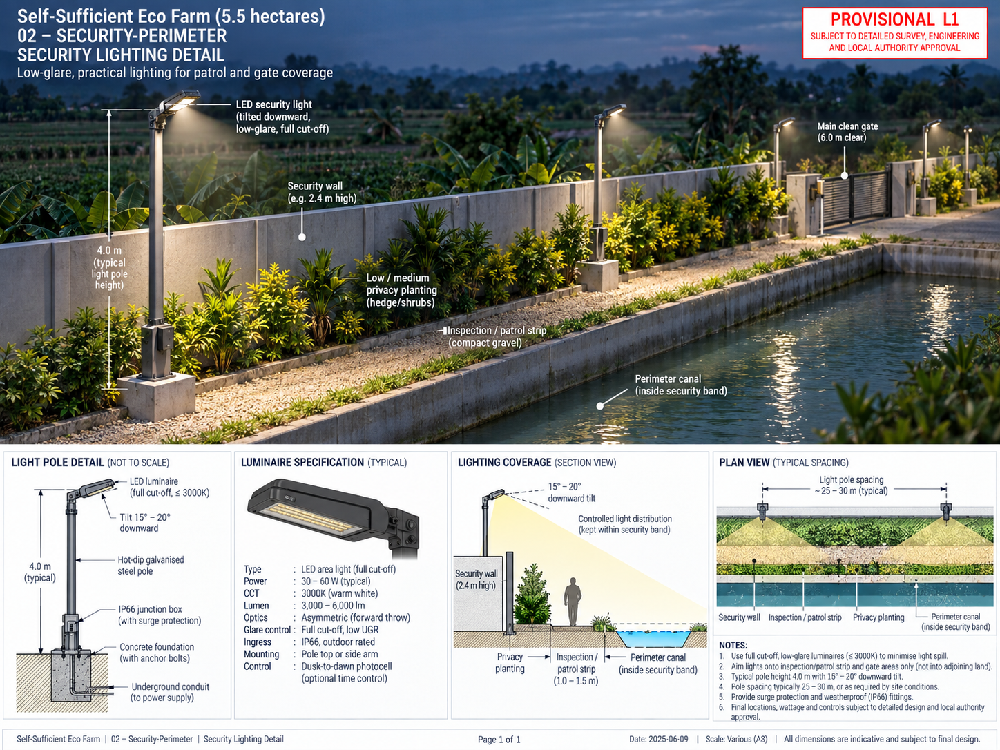
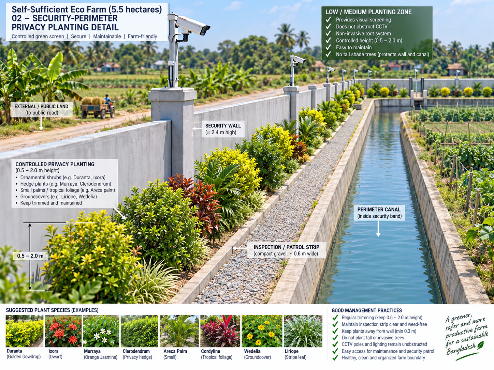

# Security Wall, Inspection & Privacy Band — Detailed Description

## What this space does

- physical security
- privacy
- inspection/patrol
- CCTV/light support
- boundary maintenance

## Why it is placed here

The wall is the outer hard-security line. Low/medium privacy planting fits inside the allocation; tall trees are limited to approved non-shading edges or extra land.

## Main dependencies

- [`eco-farm-perimeter-wall-security-space`](../../.agents/skills/eco-farm-perimeter-wall-security-space/SKILL.md)
- [`eco-farm-security-resilience`](../../.agents/skills/eco-farm-security-resilience/SKILL.md)
- [`eco-farm-electrical-lighting-cctv`](../../.agents/skills/eco-farm-electrical-lighting-cctv/SKILL.md)

## Interfaces

### Required / useful neighbors
- Legal/planning boundary outside
- Perimeter canal inside
- Main and service gate systems

### Controlled / prohibited interfaces
- canal erosion at wall footing
- large roots against wall
- uncontrolled drain outlets
- continuous tall-tree belt that shades crops

## Utility dependencies

- CCTV
- security lighting
- gate controls
- communications where needed
- wall drainage

## Drainage / wastewater principle

Keep wall footing dry; direct surface water to controlled drains without eroding the canal bank.

## Main risks

- loss of allocated area to unrelated uses
- cross-contamination between clean and dirty systems
- flood/cyclone damage
- poor maintenance access
- unplanned utility crossings
- future expansion without feed/water/energy/waste capacity checks

## Verification checklist

- [ ] Area remains within parent allocation
- [ ] L1 position is unchanged
- [ ] Required access is clear
- [ ] Drainage path is explicit
- [ ] Power/water/data needs are explicit
- [ ] Fire/emergency access is explicit
- [ ] Neighbor conflicts are checked
- [ ] Image/blueprint matches the master plan

## Detailed visual references

### Main clean gate

### Service / emergency gate

### CCTV

### Security lighting

### Privacy planting

