# Security Wall, Inspection & Privacy Band

This folder is the detailed documentation authority for the **Security Wall, Inspection & Privacy Band** space.

## Master visual reference

> Generated images are visual references only. L1/Markdown/engineering authorities control any discrepancy.

## At a glance

| Item | Value |
|---|---|
| Parent area | **1,800 m²** |
| Business role | **support** |
| Planning status | L1 / master planning |

## Core design documentation

- [Architecture](ARCHITECTURE.md)
- [Space](SPACE.md)
- [Design](DESIGN.md)
- [Image & Blueprint](IMAGE.md)
- [Details](DETAILS.md)
- [Utilities](UTILITIES.md)
- [Operations](OPERATIONS.md)

## Space systems / engineering

- [Blueprint Set](BLUEPRINT.md)
- [Space Management](SPACE_MANAGEMENT.md)
- [Drainage & Stormwater](DRAINAGE.md)
- [Water System](WATER_SYSTEM.md)
- [Electrical System](ELECTRICAL.md)
- [CCTV & Security](CCTV_SECURITY.md)
- [Daylight & Lighting](LIGHTING.md)
- [Safety & Emergency](SAFETY.md)

## Capacity, production and business documentation

- [Capacity](CAPACITY.md)
- [Production / Service Output](PRODUCTION.md)
- [Inputs & Outputs](INPUTS_OUTPUTS.md)
- [Costs](COSTS.md)
- [Economics](ECONOMICS.md)
- [Business & Value Strategy](BUSINESS.md)

## Main capacity/output snapshot

- Protects the full ~940 m plot perimeter
- Supports two controlled gate systems
- Supports CCTV/security lighting interfaces and patrol/inspection access
- No agricultural sale output
- Service output: theft/intrusion deterrence, controlled access, privacy, perimeter inspection

## Complete image gallery

| Reference | Reference |
|---|---|
| 01 — Blueprint Master 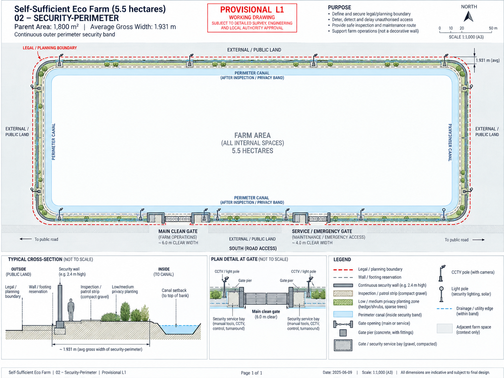 | 02 — Realistic True Top View  |
| 03 — North-West Aerial  | 04 — North-East Aerial 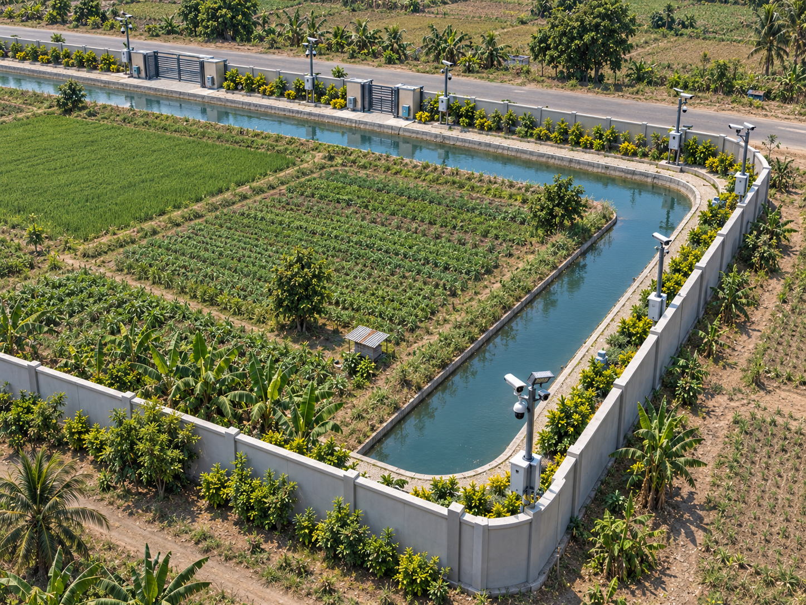 |
| 05 — South-East Aerial 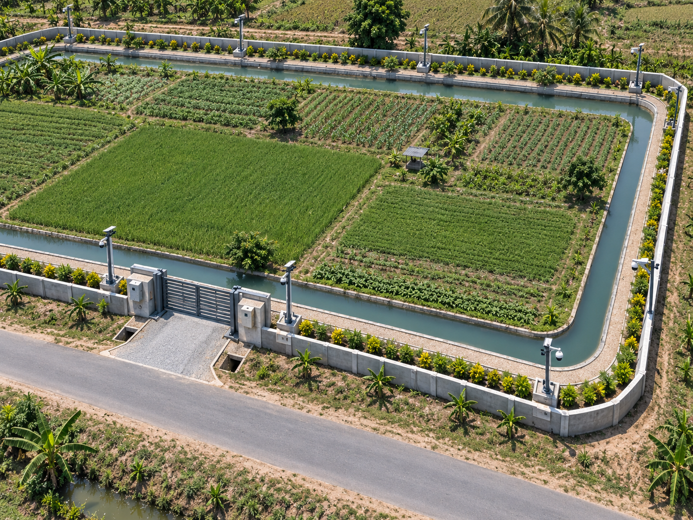 | 06 — South-West Aerial 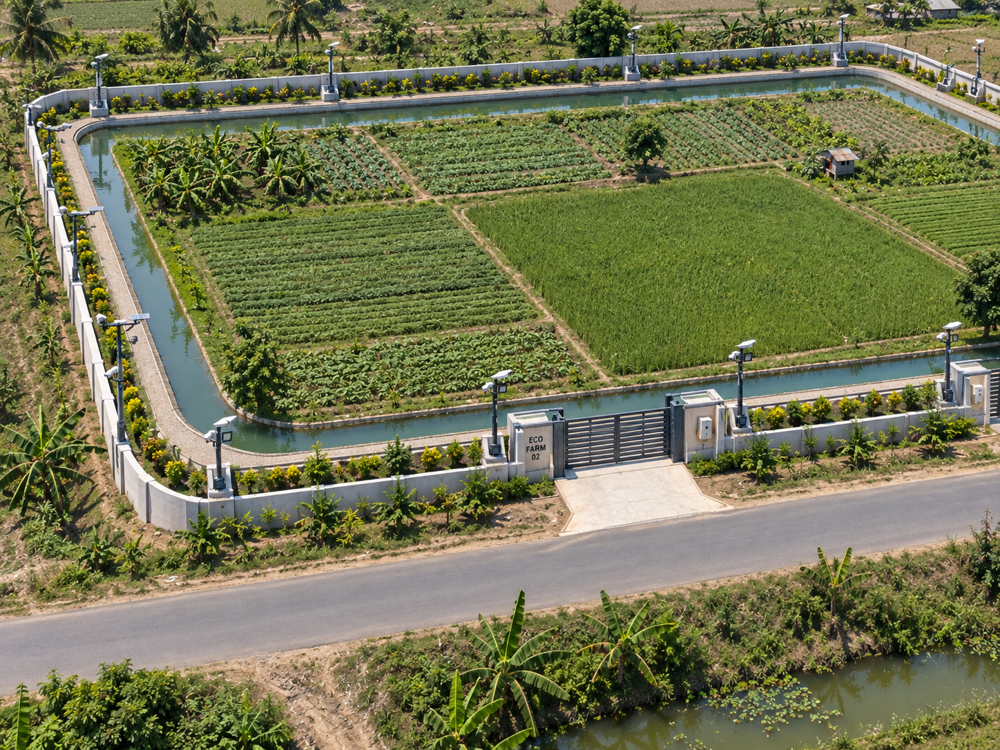 |
| 07 — North-Side View 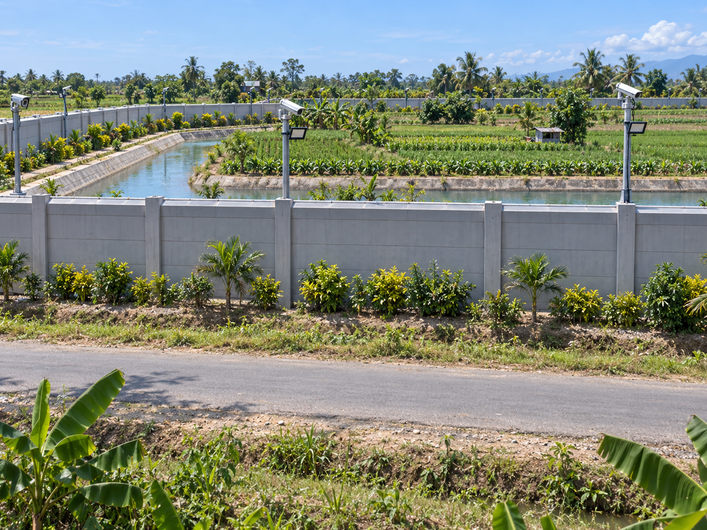 | 08 — South-Side View 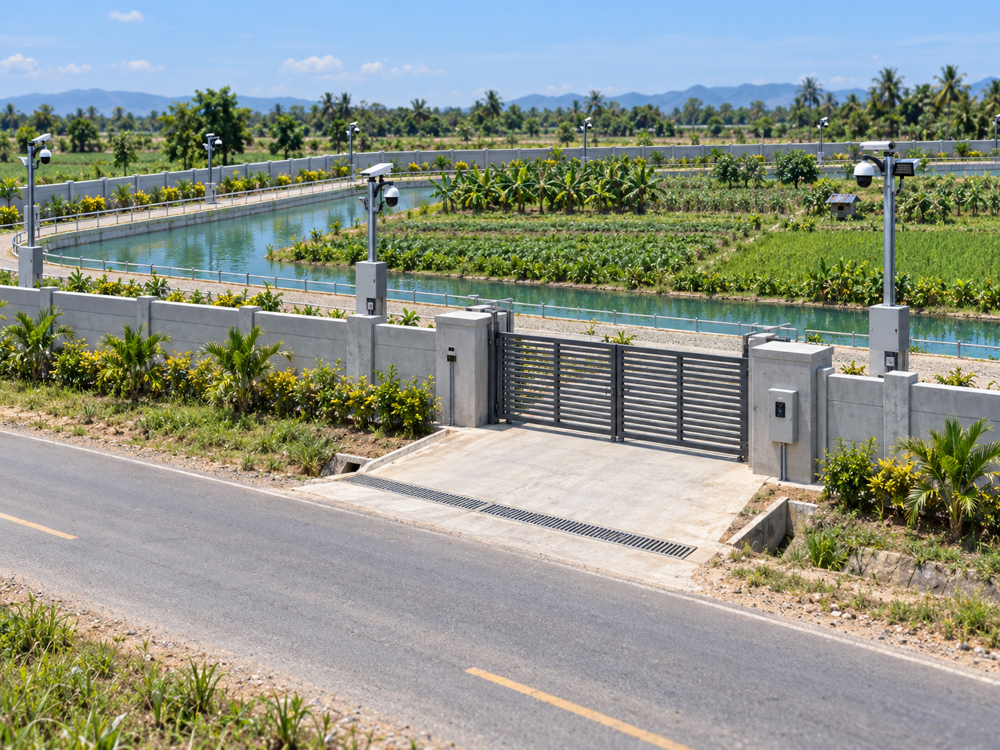 |
| 09 — East-Side View 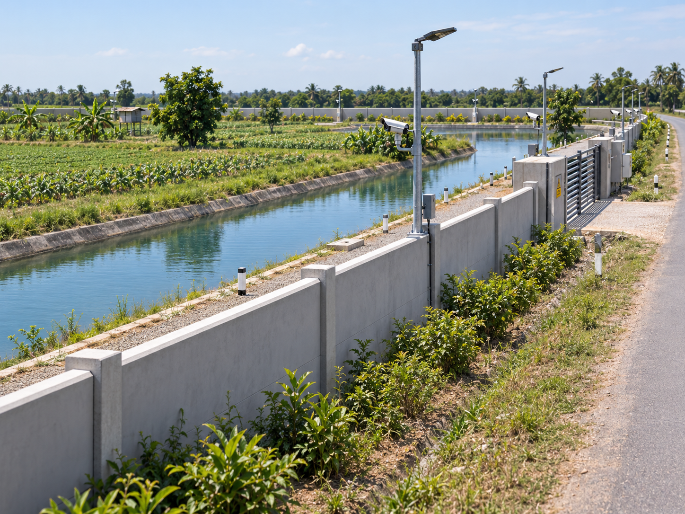 | 10 — West-Side View 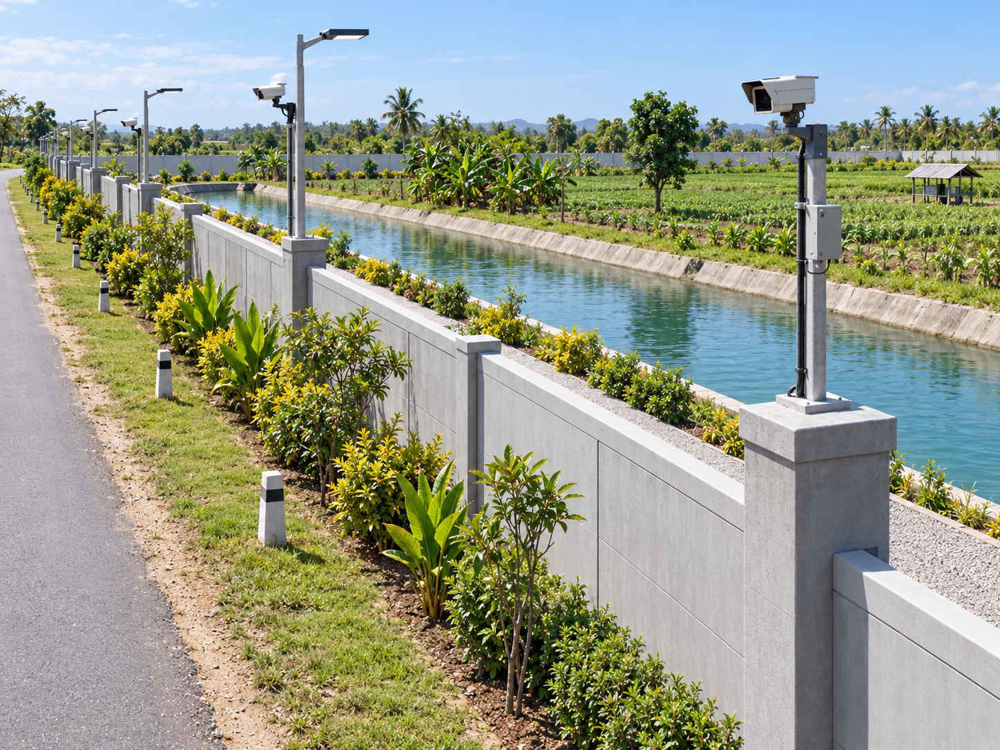 |
| 11 — Primary Patrol / Inspection View 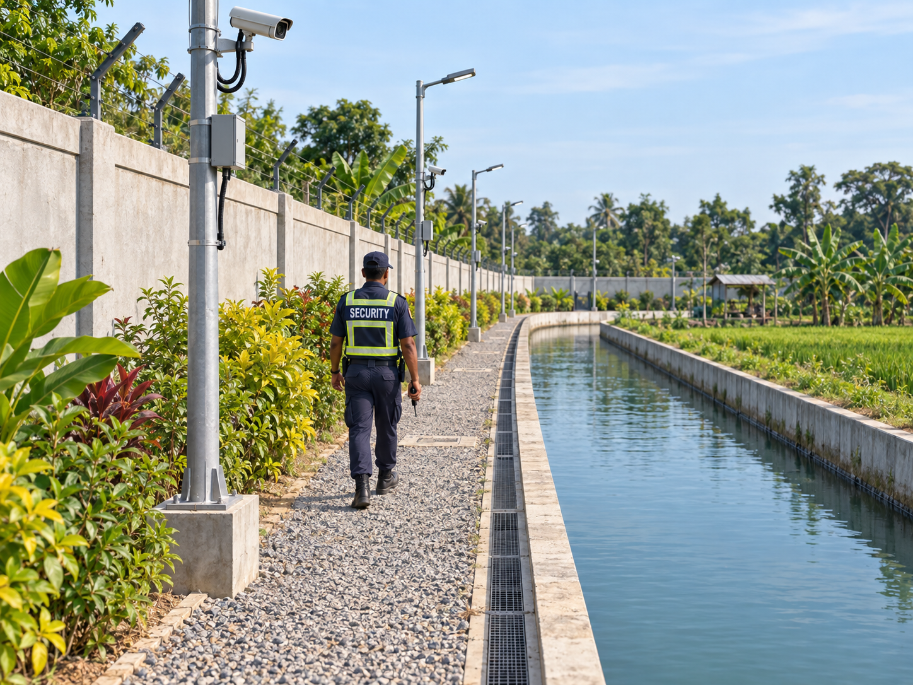 | 12 — Secondary Gate Security View 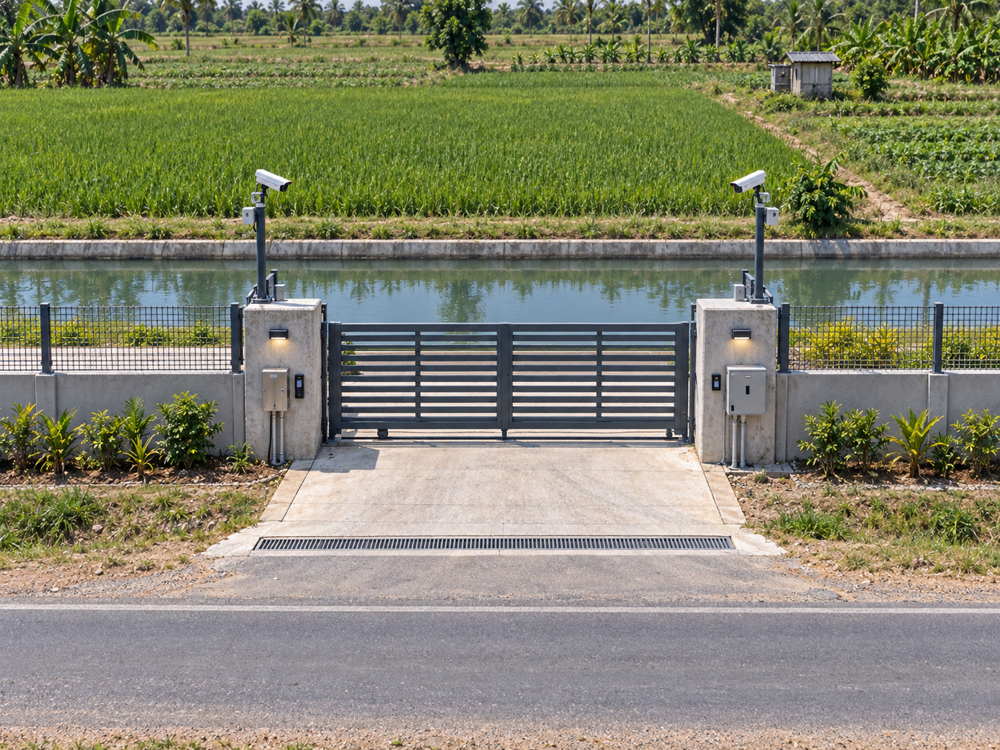 |
| 13 — Wall + Footing + Drainage Detail  | 14 — Main Clean Gate Detail  |
| 15 — Service / Emergency Gate Detail  | 16 — CCTV Security Detail  |
| 17 — Security Lighting Detail  | 18 — Privacy Planting Detail  |
| 19 — Inspection / Patrol Bay Detail 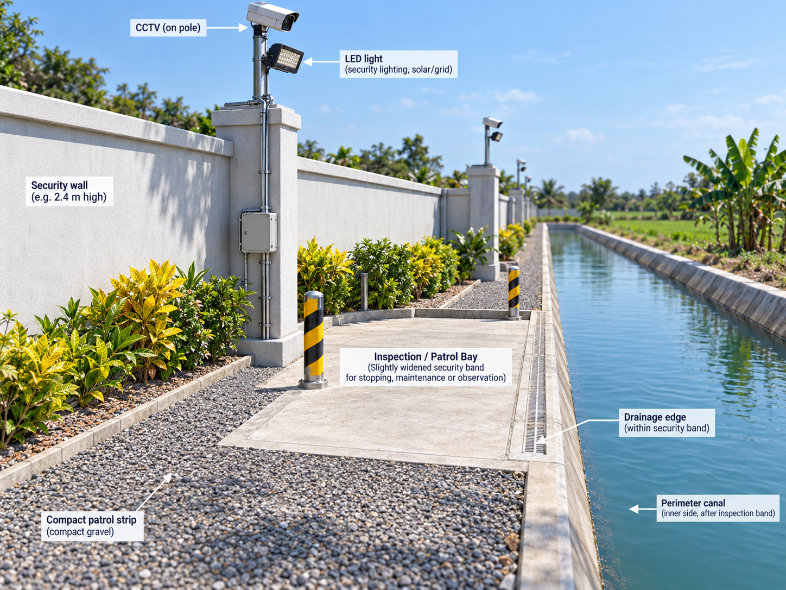 | 20 — Night Security View  |
| 21 — Monsoon / Heavy-Rain Security View 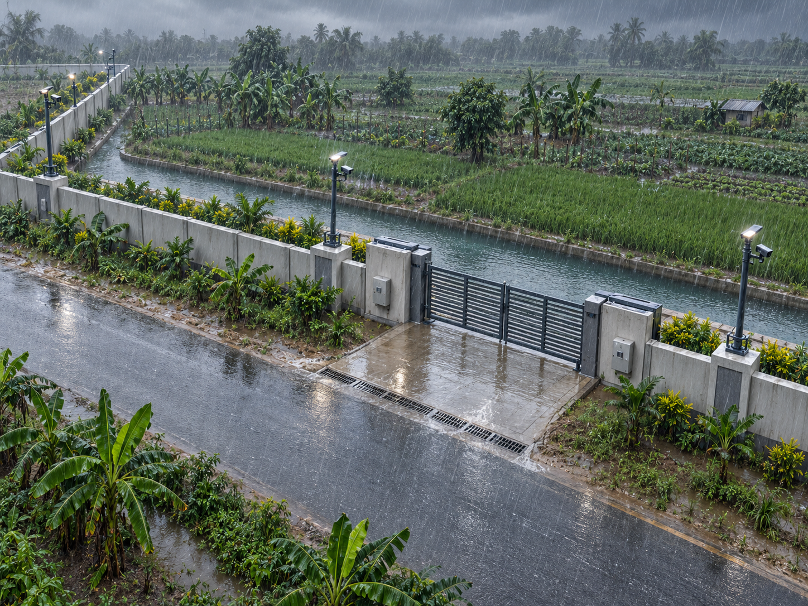 | 22 — Cyclone / High-Wind Readiness 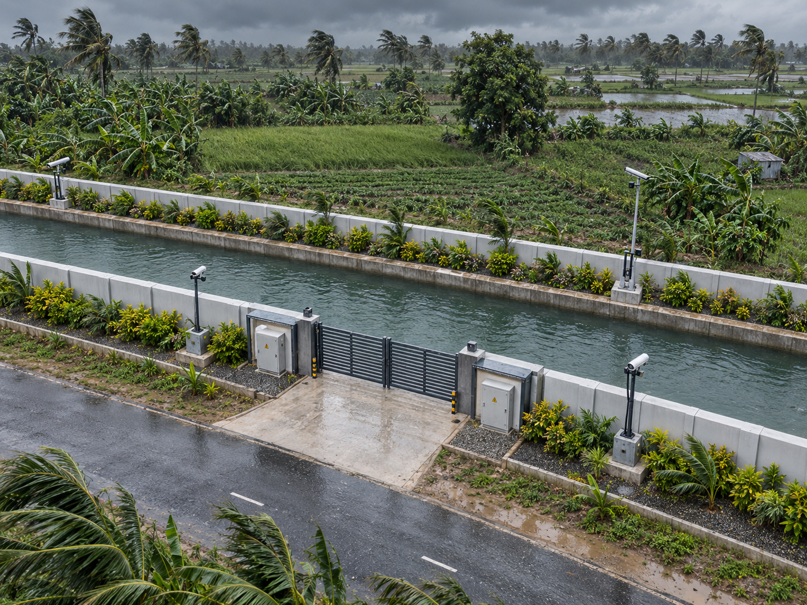 |
| 23 — Security Operations / Patrol View 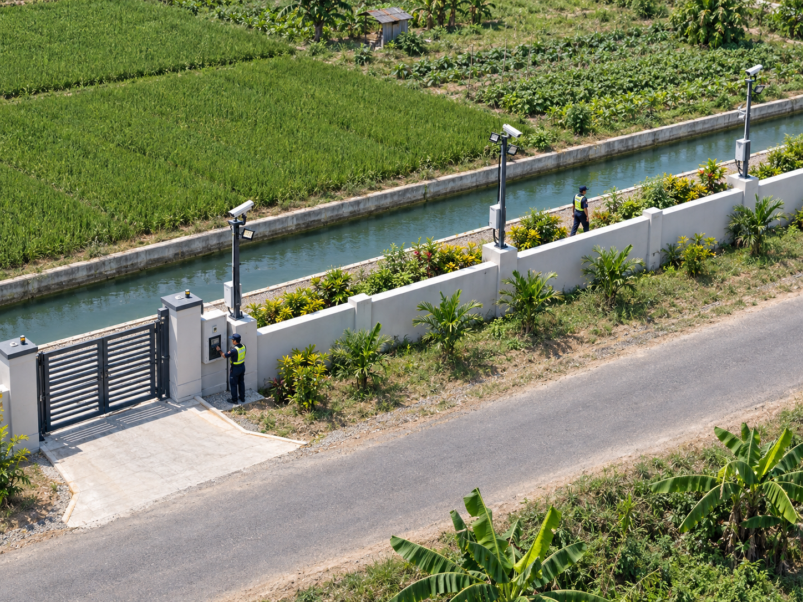 |  |

## Required rule

Do not judge this space only by cash income. Some zones create direct sales, some create internal replacement value, and some protect the rest of the farm by reducing risk or operating cost.

See [farm-wide economic assumptions](../../docs/ECONOMIC_ASSUMPTIONS.md).
