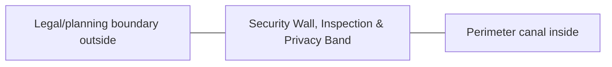
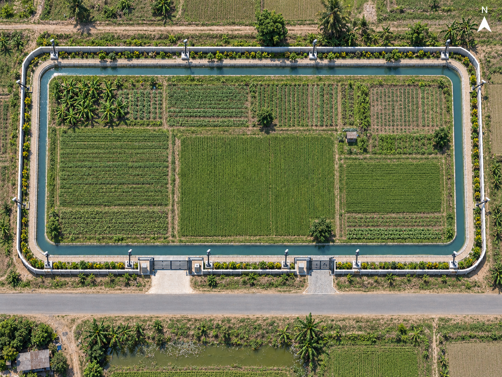

# Security Wall, Inspection & Privacy Band — Space & Coordinates

## Parent allocation

- Area: **1,800 m²**
- Area in square feet: **19,375 ft²**
- Geometry: Continuous outer security ring.
- L1 coordinate authority: **Plot edge to inner control at 1.931 m average gross inset. Local service/CCTV bays may widen.**

## Precision status

The outer zone placement is **PROVISIONAL L1** and must be preserved in all repository blueprints and images. Internal centimeter/mm positions are not yet approved unless explicitly documented here or in a dedicated subspace file.

## Space-budget rules

1. Sum all internal subspaces before approval.
2. Do not exceed the parent area.
3. Circulation, maintenance, drains, fire separation and buffers count as real area.
4. Shared utility corridors must be assigned to this zone or the 3,000 m² internal-access/buffer authority.
5. No uncounted "leftover" building may be inserted.

## Required internal functions

- physical security
- privacy
- inspection/patrol
- CCTV/light support
- boundary maintenance

## Neighbor constraints

### Preferred / required neighbors
- Legal/planning boundary outside
- Perimeter canal inside
- Main and service gate systems

### Prohibited or controlled conflicts
- canal erosion at wall footing
- large roots against wall
- uncontrolled drain outlets
- continuous tall-tree belt that shades crops

## Diagram

## Visual space reference

Use this image for visual orientation only; use the L1 values above for geometry.
