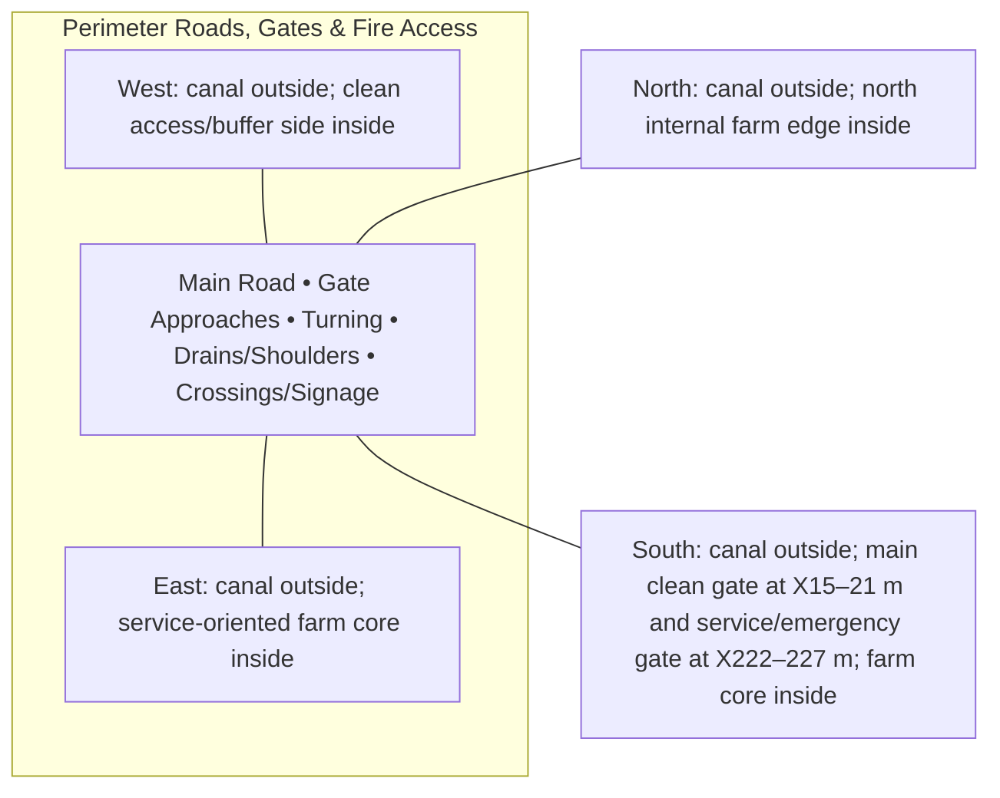

# Perimeter Roads, Gates & Fire Access — Architecture

## Architectural intent

Emergency/service circulation ring that stays continuous around the farm; internal roads use separate buffer/headland allocations.

## Parent space authority

- **Area:** 4,200 m² / 45,208 ft²
- **Geometry:** continuous perimeter fire/service ring averaging about 4.901 m plus gate approaches, shoulders and drainage
- **L1 authority:** between canal inner control ~7.927 m inset and internal-core control ~12.828 m inset
- **Status:** parent placement is PROVISIONAL L1; internal partitions/coordinates remain PROVISIONAL until approved in a detailed plan

## Four-side context

| Side | What is beside this space |
|---|---|
| North | canal outside; north internal farm edge inside |
| South | canal outside; main clean gate at X15–21 m and service/emergency gate at X222–227 m; farm core inside |
| East | canal outside; service-oriented farm core inside |
| West | canal outside; clean access/buffer side inside |

## Internal architectural area schedule

The following is the current **non-overlapping internal planning budget**. It sums to the full parent area.

| Section / part | Area m² | Area ft² | Architectural purpose |
|---|---:|---:|---|
| Main perimeter road surface | 3,300 | 35,521 | continuous fire/service circulation |
| Gate + bridge approaches | 350 | 3,767 | main/service gate approaches |
| Turning / lay-by pockets | 200 | 2,153 | emergency/service maneuvering |
| Edge drains / shoulders | 250 | 2,691 | road runoff and safety edge |
| Pedestrian / signage / utility crossing reserve | 100 | 1,076 | crossings and route control |
| **Total** | **4,200** | **45,208** | **parent space** |

## Architectural organization

1. **Main Road**
2. **Gate Approaches**
3. **Turning**
4. **Drains/Shoulders**
5. **Crossings/Signage**

## Simple architecture diagram — not to scale

## Architecture rules

- All internal parts must fit inside the parent area; no "free" uncounted space.
- Access, drainage, maintenance, fire/biosecurity separation and utility clearances are part of architecture.
- Four-side neighboring context must stay correct in drawings and images.
- Permanent architecture must not move simply to improve an image composition.
- Structural dimensions, foundations, exact room/equipment positions and code-required clearances remain subject to L2/L3 engineering.

## Related files

- [Space & Coordinates](SPACE.md)
- [Blueprint](BLUEPRINT.md)
- [Design](DESIGN.md)
- [Image](IMAGE.md)
- [Drainage](DRAINAGE.md)
- [Water](WATER_SYSTEM.md)
- [Electrical](ELECTRICAL.md)
- [CCTV/Security](CCTV_SECURITY.md)
- [Lighting](LIGHTING.md)
- [Safety](SAFETY.md)
