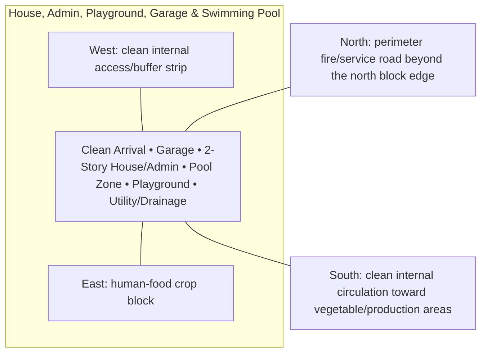

# House, Admin, Playground, Garage & Swimming Pool — Architecture

## Architectural intent

Two-story tropical duplex-style farmhouse/admin in the center-west, garage/arrival west-southwest, pool west-northwest, playground east as a low-height buffer to food crops.

## Parent space authority

- **Area:** 2,200 m² / 23,681 ft²
- **Geometry:** north-west clean rectangular residential/admin block
- **L1 authority:** X 28.627–63.384 m; Y 143.877–207.172 m
- **Status:** parent placement is PROVISIONAL L1; internal partitions/coordinates remain PROVISIONAL until approved in a detailed plan

## Four-side context

| Side | What is beside this space |
|---|---|
| North | perimeter fire/service road beyond the north block edge |
| South | clean internal circulation toward vegetable/production areas |
| East | human-food crop block |
| West | clean internal access/buffer strip |

## Internal architectural area schedule

The following is the current **non-overlapping internal planning budget**. It sums to the full parent area.

| Section / part | Area m² | Area ft² | Architectural purpose |
|---|---:|---:|---|
| 2-story house/admin footprint | 480 | 5,167 | two-floor residence + admin/control |
| Playground | 600 | 6,458 | 20×30 m play/emergency assembly |
| Residential/admin garage | 120 | 1,292 | light vehicles / optional EV |
| Swimming-pool water | 60 | 646 | concept ~12×5 m family pool |
| Pool deck / safety / equipment | 140 | 1,507 | barrier, deck, pool plant |
| Arrival drive / drop-off / pedestrian courts | 260 | 2,799 | clean access and movement |
| Utility / service area | 120 | 1,292 | meters, pool/service support |
| Drainage / pervious / safety buffers | 420 | 4,521 | rain-garden, pervious and setbacks |
| **Total** | **2,200** | **23,681** | **parent space** |

## House gross-floor program

The **480 m²** house/admin figure above is the land footprint, not the total two-floor interior area.

### Ground floor concept — 480 m² gross
| Function group | Area m² | Area ft² |
|---|---:|---:|
| Admin/reception | 65 | 700 |
| CCTV/security/control | 30 | 323 |
| First-aid/emergency | 20 | 215 |
| Living/dining | 110 | 1,184 |
| Kitchen/pantry | 45 | 484 |
| Guest/flexible bedroom | 35 | 377 |
| Toilets | 15 | 161 |
| Stairs/circulation | 70 | 753 |
| Laundry/service | 25 | 269 |
| Covered veranda/transition | 65 | 700 |
| **Total** | **480** | **5,167** |

### First floor concept — 420 m² gross
| Function group | Area m² | Area ft² |
|---|---:|---:|
| Master suite | 90 | 969 |
| Bedroom 2 | 45 | 484 |
| Bedroom 3 | 45 | 484 |
| Bedroom 4 / flex | 40 | 431 |
| Family lounge | 55 | 592 |
| Study | 30 | 323 |
| Bathrooms/wardrobes | 50 | 538 |
| Stairs/circulation | 45 | 484 |
| Balconies/terraces | 20 | 215 |
| **Total** | **420** | **4,521** |

**Concept gross floor area:** about **900 m² / 9,688 ft²** across two levels, while consuming only the 480 m² site footprint.

## Architectural organization

1. **Clean Arrival**
2. **Garage**
3. **2-Story House/Admin**
4. **Pool Zone**
5. **Playground**
6. **Utility/Drainage**

## Simple architecture diagram — not to scale

## Architecture rules

- All internal parts must fit inside the parent area; no "free" uncounted space.
- Access, drainage, maintenance, fire/biosecurity separation and utility clearances are part of architecture.
- Four-side neighboring context must stay correct in drawings and images.
- Permanent architecture must not move simply to improve an image composition.
- Structural dimensions, foundations, exact room/equipment positions and code-required clearances remain subject to L2/L3 engineering.

## Related files

- [Space & Coordinates](SPACE.md)
- [Blueprint](BLUEPRINT.md)
- [Design](DESIGN.md)
- [Image](IMAGE.md)
- [Drainage](DRAINAGE.md)
- [Water](WATER_SYSTEM.md)
- [Electrical](ELECTRICAL.md)
- [CCTV/Security](CCTV_SECURITY.md)
- [Lighting](LIGHTING.md)
- [Safety](SAFETY.md)
