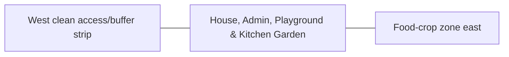

# House, Admin, Playground & Kitchen Garden — Space & Coordinates

## Parent allocation

- Area: **2,200 m²**
- Area in square feet: **23,681 ft²**
- Geometry: North-west clean/family rectangle.
- L1 coordinate authority: **X 28.627–63.384 m; Y 143.877–207.172 m. L1 block ≈34.758 × 63.296 m.**

## Precision status

The outer zone placement is **PROVISIONAL L1** and must be preserved in all repository blueprints and images. Internal centimeter/mm positions are not yet approved unless explicitly documented here or in a dedicated subspace file.

## Space-budget rules

1. Sum all internal subspaces before approval.
2. Do not exceed the parent area.
3. Circulation, maintenance, drains, fire separation and buffers count as real area.
4. Shared utility corridors must be assigned to this zone or the 3,000 m² internal-access/buffer authority.
5. No uncounted "leftover" building may be inserted.

## Required internal functions

- residence
- farm administration
- CCTV/NVR control
- first aid/emergency shelter
- play/recreation
- household kitchen garden

## Neighbor constraints

### Preferred / required neighbors
- West clean access/buffer strip
- Food-crop zone east
- Perimeter fire road north

### Prohibited or controlled conflicts
- biogas/compost
- workshop hot-work
- quarantine
- manure lanes
- heavy truck route

## Diagram

