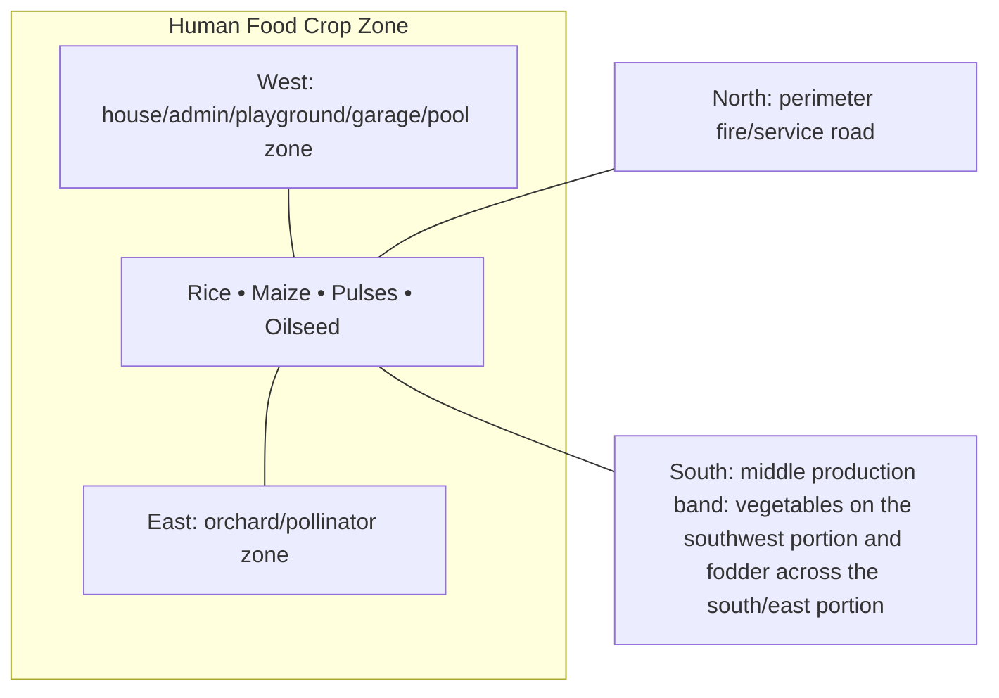

# Human Food Crop Zone — Architecture

## Architectural intent

Large uninterrupted solar envelope. Internal headlands, field drains and temporary crop lanes are embedded inside the gross crop sub-blocks.

## Parent space authority

- **Area:** 6,500 m² / 69,965 ft²
- **Geometry:** north-central open-sun rectangular field block
- **L1 authority:** X 63.384–166.077 m; Y 143.877–207.172 m
- **Status:** parent placement is PROVISIONAL L1; internal partitions/coordinates remain PROVISIONAL until approved in a detailed plan

## Four-side context

| Side | What is beside this space |
|---|---|
| North | perimeter fire/service road |
| South | middle production band: vegetables on the southwest portion and fodder across the south/east portion |
| East | orchard/pollinator zone |
| West | house/admin/playground/garage/pool zone |

## Internal architectural area schedule

The following is the current **non-overlapping internal planning budget**. It sums to the full parent area.

| Section / part | Area m² | Area ft² | Architectural purpose |
|---|---:|---:|---|
| Rice gross seasonal block | 3,000 | 32,292 | rice production; internal headlands embedded |
| Maize gross seasonal block | 1,500 | 16,146 | maize production; internal access embedded |
| Pulse / legume gross block | 1,000 | 10,764 | pulses/rotation |
| Oilseed gross block | 1,000 | 10,764 | mustard/sesame rotation |
| **Total** | **6,500** | **69,965** | **parent space** |

## Architectural organization

1. **Rice**
2. **Maize**
3. **Pulses**
4. **Oilseed**

## Simple architecture diagram — not to scale

## Architecture rules

- All internal parts must fit inside the parent area; no "free" uncounted space.
- Access, drainage, maintenance, fire/biosecurity separation and utility clearances are part of architecture.
- Four-side neighboring context must stay correct in drawings and images.
- Permanent architecture must not move simply to improve an image composition.
- Structural dimensions, foundations, exact room/equipment positions and code-required clearances remain subject to L2/L3 engineering.

## Related files

- [Space & Coordinates](SPACE.md)
- [Blueprint](BLUEPRINT.md)
- [Design](DESIGN.md)
- [Image](IMAGE.md)
- [Drainage](DRAINAGE.md)
- [Water](WATER_SYSTEM.md)
- [Electrical](ELECTRICAL.md)
- [CCTV/Security](CCTV_SECURITY.md)
- [Lighting](LIGHTING.md)
- [Safety](SAFETY.md)
