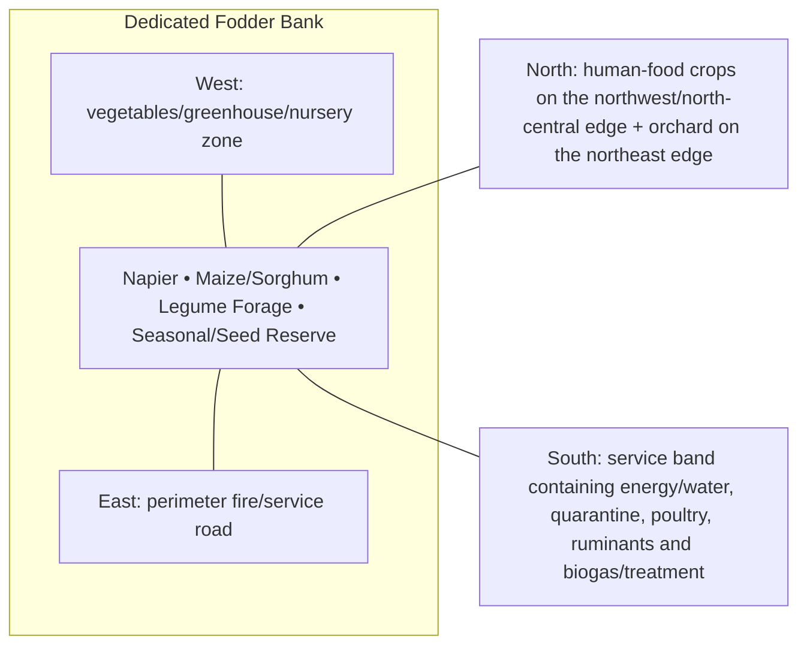

# Dedicated Fodder Bank — Architecture

## Architectural intent

Largest productive block, organized for staggered harvest and shortest possible feed route toward the animal/service band.

## Parent space authority

- **Area:** 12,000 m² / 129,167 ft²
- **Geometry:** largest middle/east production rectangle
- **L1 authority:** X 83.336–237.172 m; Y 65.871–143.877 m
- **Status:** parent placement is PROVISIONAL L1; internal partitions/coordinates remain PROVISIONAL until approved in a detailed plan

## Four-side context

| Side | What is beside this space |
|---|---|
| North | human-food crops on the northwest/north-central edge + orchard on the northeast edge |
| South | service band containing energy/water, quarantine, poultry, ruminants and biogas/treatment |
| East | perimeter fire/service road |
| West | vegetables/greenhouse/nursery zone |

## Internal architectural area schedule

The following is the current **non-overlapping internal planning budget**. It sums to the full parent area.

| Section / part | Area m² | Area ft² | Architectural purpose |
|---|---:|---:|---|
| Napier / perennial fodder | 5,800 | 62,431 | primary cut-and-carry block |
| Fodder maize / sorghum | 2,800 | 30,139 | silage/seasonal energy fodder |
| Legume forage | 1,700 | 18,299 | protein forage / rotation |
| Seasonal fodder / seed / controlled azolla-duckweed reserve | 1,700 | 18,299 | seasonal flexibility and planting material |
| **Total** | **12,000** | **129,167** | **parent space** |

## Architectural organization

1. **Napier**
2. **Maize/Sorghum**
3. **Legume Forage**
4. **Seasonal/Seed Reserve**

## Simple architecture diagram — not to scale

## Architecture rules

- All internal parts must fit inside the parent area; no "free" uncounted space.
- Access, drainage, maintenance, fire/biosecurity separation and utility clearances are part of architecture.
- Four-side neighboring context must stay correct in drawings and images.
- Permanent architecture must not move simply to improve an image composition.
- Structural dimensions, foundations, exact room/equipment positions and code-required clearances remain subject to L2/L3 engineering.

## Related files

- [Space & Coordinates](SPACE.md)
- [Blueprint](BLUEPRINT.md)
- [Design](DESIGN.md)
- [Image](IMAGE.md)
- [Drainage](DRAINAGE.md)
- [Water](WATER_SYSTEM.md)
- [Electrical](ELECTRICAL.md)
- [CCTV/Security](CCTV_SECURITY.md)
- [Lighting](LIGHTING.md)
- [Safety](SAFETY.md)
