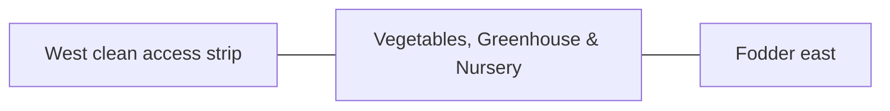

# Vegetables, Greenhouse & Nursery — Architecture

## Architectural intent

Open beds dominate, with compact greenhouse and nursery structures arranged for hygiene and service access.

## L1 placement

X 25.648–83.336 m; Y 65.871–143.877 m. L1 block ≈57.689 × 78.005 m.

## Adjacency

- West clean access strip
- Fodder east
- House/crops north
- Processing south-west

## Spaces / functions inside this zone

- open vegetable beds
- greenhouse/protected crops
- nursery/mother plants
- clean wash/service point

## Architecture rules

- Keep the parent area at **4,500 m²**.
- Preserve clean/dirty traffic separation appropriate to this zone.
- Reserve maintenance and emergency access before adding decorative elements.
- Building footprints, internal partitions and exact equipment positions are **PROVISIONAL** until L2/L3 design.
- Any structure must respect flood, cyclone, fire, biosecurity and drainage requirements.

## Section relationship

## Cross references

- [Space budget](SPACE.md)
- [Design rules](DESIGN.md)
- [Utilities](UTILITIES.md)
- [Image rules](IMAGE.md)
