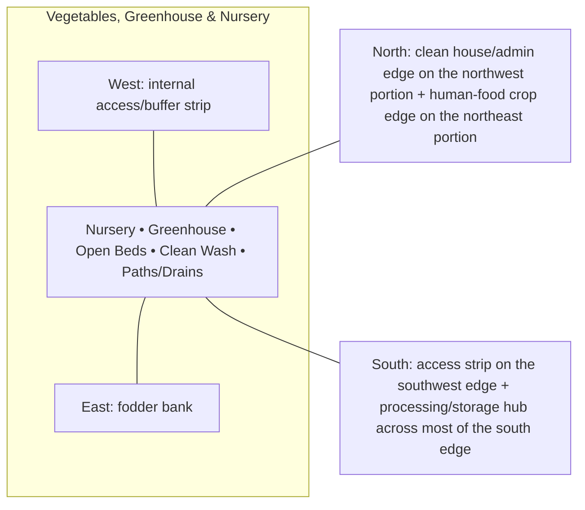

# Vegetables, Greenhouse & Nursery — Architecture

## Architectural intent

Compact protected-crop and nursery structures embedded in a mostly open-bed production zone with clean service access.

## Parent space authority

- **Area:** 4,500 m² / 48,438 ft²
- **Geometry:** middle-west clean horticulture rectangle
- **L1 authority:** X 25.648–83.336 m; Y 65.871–143.877 m
- **Status:** parent placement is PROVISIONAL L1; internal partitions/coordinates remain PROVISIONAL until approved in a detailed plan

## Four-side context

| Side | What is beside this space |
|---|---|
| North | clean house/admin edge on the northwest portion + human-food crop edge on the northeast portion |
| South | access strip on the southwest edge + processing/storage hub across most of the south edge |
| East | fodder bank |
| West | internal access/buffer strip |

## Internal architectural area schedule

The following is the current **non-overlapping internal planning budget**. It sums to the full parent area.

| Section / part | Area m² | Area ft² | Architectural purpose |
|---|---:|---:|---|
| Open rotation beds | 2,700 | 29,063 | main vegetable production |
| Greenhouse / protected crop | 850 | 9,149 | protected high-value production |
| Nursery / mother plants | 300 | 3,229 | seedling and planting-material production |
| Clean wash / service point | 150 | 1,615 | harvest handling |
| Paths / drains / internal service | 500 | 5,382 | circulation, hygiene and water management |
| **Total** | **4,500** | **48,438** | **parent space** |

## Architectural organization

1. **Nursery**
2. **Greenhouse**
3. **Open Beds**
4. **Clean Wash**
5. **Paths/Drains**

## Simple architecture diagram — not to scale

## Architecture rules

- All internal parts must fit inside the parent area; no "free" uncounted space.
- Access, drainage, maintenance, fire/biosecurity separation and utility clearances are part of architecture.
- Four-side neighboring context must stay correct in drawings and images.
- Permanent architecture must not move simply to improve an image composition.
- Structural dimensions, foundations, exact room/equipment positions and code-required clearances remain subject to L2/L3 engineering.

## Related files

- [Space & Coordinates](SPACE.md)
- [Blueprint](BLUEPRINT.md)
- [Design](DESIGN.md)
- [Image](IMAGE.md)
- [Drainage](DRAINAGE.md)
- [Water](WATER_SYSTEM.md)
- [Electrical](ELECTRICAL.md)
- [CCTV/Security](CCTV_SECURITY.md)
- [Lighting](LIGHTING.md)
- [Safety](SAFETY.md)
