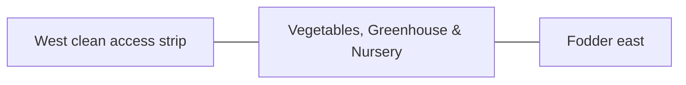

# Vegetables, Greenhouse & Nursery — Space & Coordinates

## Parent allocation

- Area: **4,500 m²**
- Area in square feet: **48,438 ft²**
- Geometry: Middle-west clean-production rectangle.
- L1 coordinate authority: **X 25.648–83.336 m; Y 65.871–143.877 m. L1 block ≈57.689 × 78.005 m.**

## Precision status

The outer zone placement is **PROVISIONAL L1** and must be preserved in all repository blueprints and images. Internal centimeter/mm positions are not yet approved unless explicitly documented here or in a dedicated subspace file.

## Space-budget rules

1. Sum all internal subspaces before approval.
2. Do not exceed the parent area.
3. Circulation, maintenance, drains, fire separation and buffers count as real area.
4. Shared utility corridors must be assigned to this zone or the 3,000 m² internal-access/buffer authority.
5. No uncounted "leftover" building may be inserted.

## Required internal functions

- open vegetable beds
- greenhouse/protected crops
- nursery/mother plants
- clean wash/service point

## Neighbor constraints

### Preferred / required neighbors
- West clean access strip
- Fodder east
- House/crops north
- Processing south-west

### Prohibited or controlled conflicts
- animal manure traffic
- raw slurry irrigation
- dirty crates
- uncontrolled shade

## Diagram

