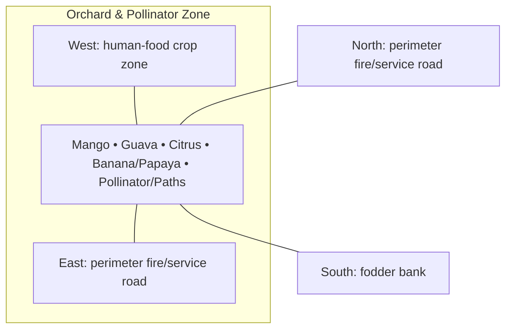

# Orchard & Pollinator Zone — Architecture

## Architectural intent

Tallest canopy biased north/east; managed fruit blocks stay out of the food-crop solar envelope.

## Parent space authority

- **Area:** 4,500 m² / 48,438 ft²
- **Geometry:** north-east orchard rectangle
- **L1 authority:** X 166.077–237.172 m; Y 143.877–207.172 m
- **Status:** parent placement is PROVISIONAL L1; internal partitions/coordinates remain PROVISIONAL until approved in a detailed plan

## Four-side context

| Side | What is beside this space |
|---|---|
| North | perimeter fire/service road |
| South | fodder bank |
| East | perimeter fire/service road |
| West | human-food crop zone |

## Internal architectural area schedule

The following is the current **non-overlapping internal planning budget**. It sums to the full parent area.

| Section / part | Area m² | Area ft² | Architectural purpose |
|---|---:|---:|---|
| Mango | 1,500 | 16,146 | tall-canopy fruit block |
| Guava | 750 | 8,073 | medium-canopy fruit block |
| Citrus / lemon | 750 | 8,073 | medium/low fruit block |
| Banana / papaya | 1,000 | 10,764 | fast-bearing fruit layer |
| Pollinator strips / bees / paths / drains | 500 | 5,382 | pollination, service and drainage |
| **Total** | **4,500** | **48,438** | **parent space** |

## Architectural organization

1. **Mango**
2. **Guava**
3. **Citrus**
4. **Banana/Papaya**
5. **Pollinator/Paths**

## Simple architecture diagram — not to scale

## Architecture rules

- All internal parts must fit inside the parent area; no "free" uncounted space.
- Access, drainage, maintenance, fire/biosecurity separation and utility clearances are part of architecture.
- Four-side neighboring context must stay correct in drawings and images.
- Permanent architecture must not move simply to improve an image composition.
- Structural dimensions, foundations, exact room/equipment positions and code-required clearances remain subject to L2/L3 engineering.

## Related files

- [Space & Coordinates](SPACE.md)
- [Blueprint](BLUEPRINT.md)
- [Design](DESIGN.md)
- [Image](IMAGE.md)
- [Drainage](DRAINAGE.md)
- [Water](WATER_SYSTEM.md)
- [Electrical](ELECTRICAL.md)
- [CCTV/Security](CCTV_SECURITY.md)
- [Lighting](LIGHTING.md)
- [Safety](SAFETY.md)
