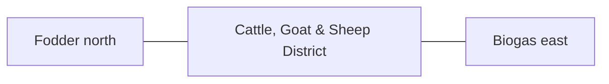

# Cattle, Goat & Sheep District — Architecture

## Architectural intent

Feed enters from north/clean side; manure exits east/south dirty side toward biogas.

## L1 placement

X 146.680–207.008 m; Y 12.828–65.871 m. L1 block ≈60.328 × 53.043 m.

## Adjacency

- Fodder north
- Biogas east
- Poultry west
- Perimeter service road south

## Spaces / functions inside this zone

- cattle housing
- goat/sheep housing
- yards
- maternity/youngstock
- feeding/milking
- manure collection

## Architecture rules

- Keep the parent area at **3,200 m²**.
- Preserve clean/dirty traffic separation appropriate to this zone.
- Reserve maintenance and emergency access before adding decorative elements.
- Building footprints, internal partitions and exact equipment positions are **PROVISIONAL** until L2/L3 design.
- Any structure must respect flood, cyclone, fire, biosecurity and drainage requirements.

## Section relationship

## Cross references

- [Space budget](SPACE.md)
- [Design rules](DESIGN.md)
- [Utilities](UTILITIES.md)
- [Image rules](IMAGE.md)
