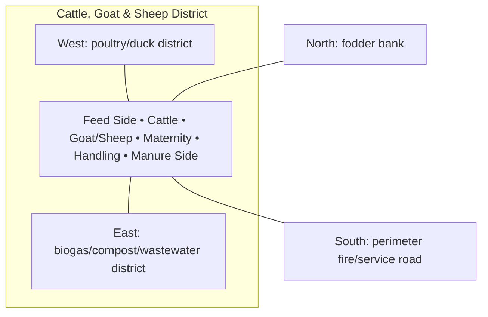

# Cattle, Goat & Sheep District — Architecture

## Architectural intent

Feed enters from the north/clean side; manure exits east/south toward biogas. Species, youngstock and clean/dirty functions remain separated.

## Parent space authority

- **Area:** 3,200 m² / 34,444 ft²
- **Geometry:** south-east-central livestock rectangle
- **L1 authority:** X 146.680–207.008 m; Y 12.828–65.871 m
- **Status:** parent placement is PROVISIONAL L1; internal partitions/coordinates remain PROVISIONAL until approved in a detailed plan

## Four-side context

| Side | What is beside this space |
|---|---|
| North | fodder bank |
| South | perimeter fire/service road |
| East | biogas/compost/wastewater district |
| West | poultry/duck district |

## Internal architectural area schedule

The following is the current **non-overlapping internal planning budget**. It sums to the full parent area.

| Section / part | Area m² | Area ft² | Architectural purpose |
|---|---:|---:|---|
| Cattle shed | 400 | 4,306 | covered resting/housing |
| Cattle yard | 600 | 6,458 | exercise and handling |
| Goat / sheep area | 350 | 3,767 | separate small-ruminant housing/yard |
| Maternity / youngstock | 300 | 3,229 | protected animal-care zone |
| Milking / handling | 150 | 1,615 | clean handling where used |
| Feed alley / local feed storage | 300 | 3,229 | clean feed-side circulation |
| Manure lanes / wash control | 250 | 2,691 | dirty-side transfer |
| Circulation / ventilation / safety buffers | 850 | 9,149 | internal movement and separation |
| **Total** | **3,200** | **34,444** | **parent space** |

## Architectural organization

1. **Feed Side**
2. **Cattle**
3. **Goat/Sheep**
4. **Maternity**
5. **Handling**
6. **Manure Side**

## Simple architecture diagram — not to scale

## Architecture rules

- All internal parts must fit inside the parent area; no "free" uncounted space.
- Access, drainage, maintenance, fire/biosecurity separation and utility clearances are part of architecture.
- Four-side neighboring context must stay correct in drawings and images.
- Permanent architecture must not move simply to improve an image composition.
- Structural dimensions, foundations, exact room/equipment positions and code-required clearances remain subject to L2/L3 engineering.

## Related files

- [Space & Coordinates](SPACE.md)
- [Blueprint](BLUEPRINT.md)
- [Design](DESIGN.md)
- [Image](IMAGE.md)
- [Drainage](DRAINAGE.md)
- [Water](WATER_SYSTEM.md)
- [Electrical](ELECTRICAL.md)
- [CCTV/Security](CCTV_SECURITY.md)
- [Lighting](LIGHTING.md)
- [Safety](SAFETY.md)
