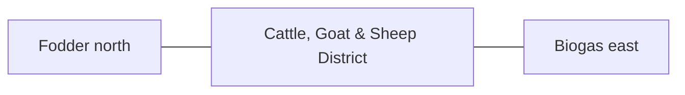

# Cattle, Goat & Sheep District — Space & Coordinates

## Parent allocation

- Area: **3,200 m²**
- Area in square feet: **34,445 ft²**
- Geometry: South-east-central service rectangle.
- L1 coordinate authority: **X 146.680–207.008 m; Y 12.828–65.871 m. L1 block ≈60.328 × 53.043 m.**

## Precision status

The outer zone placement is **PROVISIONAL L1** and must be preserved in all repository blueprints and images. Internal centimeter/mm positions are not yet approved unless explicitly documented here or in a dedicated subspace file.

## Space-budget rules

1. Sum all internal subspaces before approval.
2. Do not exceed the parent area.
3. Circulation, maintenance, drains, fire separation and buffers count as real area.
4. Shared utility corridors must be assigned to this zone or the 3,000 m² internal-access/buffer authority.
5. No uncounted "leftover" building may be inserted.

## Required internal functions

- cattle housing
- goat/sheep housing
- yards
- maternity/youngstock
- feeding/milking
- manure collection

## Neighbor constraints

### Preferred / required neighbors
- Fodder north
- Biogas east
- Poultry west
- Perimeter service road south

### Prohibited or controlled conflicts
- clean packhouse traffic
- playground/family route
- untreated manure runoff
- overstocking

## Diagram

