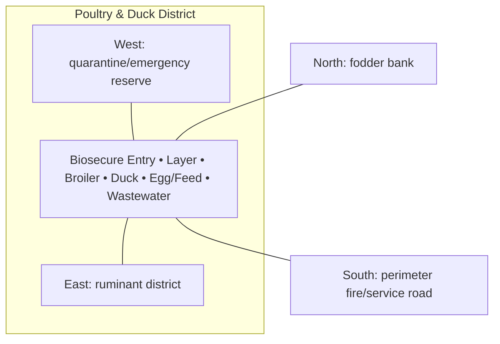

# Poultry & Duck District — Architecture

## Architectural intent

Three physically distinct bird systems with a clean biosecurity entry and a separated wet duck area.

## Parent space authority

- **Area:** 1,500 m² / 16,146 ft²
- **Geometry:** south service bird-production rectangle
- **L1 authority:** X 118.402–146.680 m; Y 12.828–65.871 m
- **Status:** parent placement is PROVISIONAL L1; internal partitions/coordinates remain PROVISIONAL until approved in a detailed plan

## Four-side context

| Side | What is beside this space |
|---|---|
| North | fodder bank |
| South | perimeter fire/service road |
| East | ruminant district |
| West | quarantine/emergency reserve |

## Internal architectural area schedule

The following is the current **non-overlapping internal planning budget**. It sums to the full parent area.

| Section / part | Area m² | Area ft² | Architectural purpose |
|---|---:|---:|---|
| Layer house | 180 | 1,938 | egg-production house |
| Broiler house | 120 | 1,292 | all-in/all-out meat-bird house |
| Duck house | 120 | 1,292 | duck shelter |
| Duck wet/service yard | 350 | 3,767 | controlled wet recreation/service |
| Feed + egg handling | 100 | 1,076 | clean feed/egg support |
| Isolation | 80 | 861 | bird isolation |
| Biosecurity entry / service | 150 | 1,615 | controlled entry and sanitation |
| Circulation / buffers | 400 | 4,306 | separation and work access |
| **Total** | **1,500** | **16,146** | **parent space** |

## Architectural organization

1. **Biosecure Entry**
2. **Layer**
3. **Broiler**
4. **Duck**
5. **Egg/Feed**
6. **Wastewater**

## Simple architecture diagram — not to scale

## Architecture rules

- All internal parts must fit inside the parent area; no "free" uncounted space.
- Access, drainage, maintenance, fire/biosecurity separation and utility clearances are part of architecture.
- Four-side neighboring context must stay correct in drawings and images.
- Permanent architecture must not move simply to improve an image composition.
- Structural dimensions, foundations, exact room/equipment positions and code-required clearances remain subject to L2/L3 engineering.

## Related files

- [Space & Coordinates](SPACE.md)
- [Blueprint](BLUEPRINT.md)
- [Design](DESIGN.md)
- [Image](IMAGE.md)
- [Drainage](DRAINAGE.md)
- [Water](WATER_SYSTEM.md)
- [Electrical](ELECTRICAL.md)
- [CCTV/Security](CCTV_SECURITY.md)
- [Lighting](LIGHTING.md)
- [Safety](SAFETY.md)
