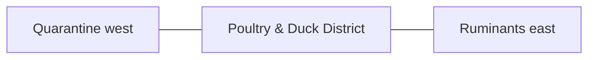

# Poultry & Duck District — Space & Coordinates

## Parent allocation

- Area: **1,500 m²**
- Area in square feet: **16,146 ft²**
- Geometry: South service rectangle between quarantine and ruminants.
- L1 coordinate authority: **X 118.402–146.680 m; Y 12.828–65.871 m. L1 block ≈28.279 × 53.043 m.**

## Precision status

The outer zone placement is **PROVISIONAL L1** and must be preserved in all repository blueprints and images. Internal centimeter/mm positions are not yet approved unless explicitly documented here or in a dedicated subspace file.

## Space-budget rules

1. Sum all internal subspaces before approval.
2. Do not exceed the parent area.
3. Circulation, maintenance, drains, fire separation and buffers count as real area.
4. Shared utility corridors must be assigned to this zone or the 3,000 m² internal-access/buffer authority.
5. No uncounted "leftover" building may be inserted.

## Required internal functions

- layer house
- broiler house
- duck house
- duck wet pad
- egg handling
- bird isolation

## Neighbor constraints

### Preferred / required neighbors
- Quarantine west
- Ruminants east
- Fodder north
- Perimeter service road south

### Prohibited or controlled conflicts
- mixing species equipment
- direct canal discharge
- clean packhouse traffic
- central fish pond creation

## Diagram

