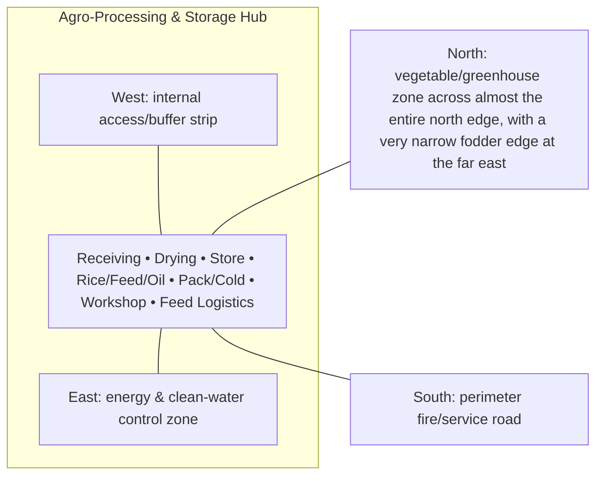

# Agro-Processing & Storage Hub — Architecture

## Architectural intent

Compact cluster with strict clean/dusty/wet/cold/hot-work/fire-load separation and short receiving/dispatch routes.

## Parent space authority

- **Area:** 2,800 m² / 30,139 ft²
- **Geometry:** south-west service/processing rectangle
- **L1 authority:** X 31.680–84.467 m; Y 12.828–65.871 m
- **Status:** parent placement is PROVISIONAL L1; internal partitions/coordinates remain PROVISIONAL until approved in a detailed plan

## Four-side context

| Side | What is beside this space |
|---|---|
| North | vegetable/greenhouse zone across almost the entire north edge, with a very narrow fodder edge at the far east |
| South | perimeter fire/service road |
| East | energy & clean-water control zone |
| West | internal access/buffer strip |

## Internal architectural area schedule

The following is the current **non-overlapping internal planning budget**. It sums to the full parent area.

| Section / part | Area m² | Area ft² | Architectural purpose |
|---|---:|---:|---|
| Crop receiving / weighing | 160 | 1,722 | arrival and measurement |
| Covered drying | 220 | 2,368 | weather-protected drying |
| Solar dryer | 60 | 646 | specialty drying |
| Grain store | 400 | 4,306 | 10–20 t base dry-grain concept |
| Rice mill | 200 | 2,153 | 100–200 kg/h base concept |
| Feed mill | 270 | 2,906 | farm feed processing |
| Oil press | 90 | 969 | small oilseed processing |
| Seed bank | 90 | 969 | seed reserve |
| Cold room + packhouse | 300 | 3,229 | produce cold-chain |
| Clean milk/egg/fish handling | 170 | 1,830 | clean animal-product handling |
| Workshop + spares | 260 | 2,799 | maintenance/hot-work controlled zone |
| Silage/hay/feed logistics | 280 | 3,014 | feed reserve support |
| Internal circulation / fire separation / utilities | 300 | 3,229 | shared safe circulation |
| **Total** | **2,800** | **30,139** | **parent space** |

## Architectural organization

1. **Receiving**
2. **Drying**
3. **Store**
4. **Rice/Feed/Oil**
5. **Pack/Cold**
6. **Workshop**
7. **Feed Logistics**

## Simple architecture diagram — not to scale

## Architecture rules

- All internal parts must fit inside the parent area; no "free" uncounted space.
- Access, drainage, maintenance, fire/biosecurity separation and utility clearances are part of architecture.
- Four-side neighboring context must stay correct in drawings and images.
- Permanent architecture must not move simply to improve an image composition.
- Structural dimensions, foundations, exact room/equipment positions and code-required clearances remain subject to L2/L3 engineering.

## Related files

- [Space & Coordinates](SPACE.md)
- [Blueprint](BLUEPRINT.md)
- [Design](DESIGN.md)
- [Image](IMAGE.md)
- [Drainage](DRAINAGE.md)
- [Water](WATER_SYSTEM.md)
- [Electrical](ELECTRICAL.md)
- [CCTV/Security](CCTV_SECURITY.md)
- [Lighting](LIGHTING.md)
- [Safety](SAFETY.md)
