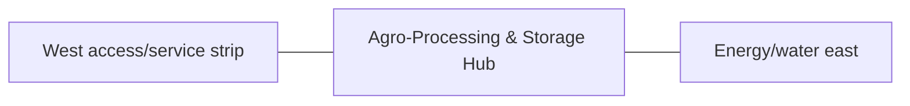

# Agro-Processing & Storage Hub

This folder is the detailed documentation authority for the **Agro-Processing & Storage Hub** space.

## At a glance

| Item | Value |
|---|---|
| Farm area allocation | **2,800 m² / 30,139 ft²** |
| L1 geometry | South-west service rectangle east of the access strip. |
| L1 coordinate authority | X 31.680–84.467 m; Y 12.828–65.871 m. L1 block ≈52.787 × 53.043 m. |
| Status | **PROVISIONAL L1** — authoritative for repository drawings/images, not legal/construction staking |

## Purpose

- crop receiving/drying
- grain storage
- rice milling
- feed milling
- oil pressing
- seed bank
- cold chain
- clean food handling
- workshop
- feed logistics

## Required skills

- [`eco-farm-processing-storage-space`](../../.agents/skills/eco-farm-processing-storage-space/SKILL.md)
- [`eco-farm-processing-storage`](../../.agents/skills/eco-farm-processing-storage/SKILL.md)
- [`eco-farm-grain-rice-mill-space`](../../.agents/skills/eco-farm-grain-rice-mill-space/SKILL.md)
- [`eco-farm-feed-silage-hay-space`](../../.agents/skills/eco-farm-feed-silage-hay-space/SKILL.md)
- [`eco-farm-cold-chain-packhouse-space`](../../.agents/skills/eco-farm-cold-chain-packhouse-space/SKILL.md)
- [`eco-farm-workshop-garage-space`](../../.agents/skills/eco-farm-workshop-garage-space/SKILL.md)

## Folder documents

- [Architecture](ARCHITECTURE.md) — physical organization, adjacency and internal architecture
- [Space](SPACE.md) — area, coordinates, dimensions and subspace budget
- [Design](DESIGN.md) — design rules, safety, environmental and material concepts
- [Image](IMAGE.md) — blueprint/render/image-generation rules
- [Details](DETAILS.md) — complete component/interface description
- [Utilities](UTILITIES.md) — power, water, drainage, data, fire and waste interfaces
- [Operations](OPERATIONS.md) — operating routines, records and KPIs
- [GRAIN RICE MILL](GRAIN_RICE_MILL.md) — dedicated subspace detail
- [FEED SILAGE HAY](FEED_SILAGE_HAY.md) — dedicated subspace detail
- [COLD CHAIN PACKHOUSE](COLD_CHAIN_PACKHOUSE.md) — dedicated subspace detail
- [WORKSHOP GARAGE](WORKSHOP_GARAGE.md) — dedicated subspace detail

## Neighbor relationship

## Must stay compatible with

- [`../../SPACE.md`](../../SPACE.md)
- [`../../docs/COORDINATE_MASTER_PLAN_L1.md`](../../docs/COORDINATE_MASTER_PLAN_L1.md)
- [`../../docs/SPACE_REGISTRY.md`](../../docs/SPACE_REGISTRY.md)
- [`../../docs/SPATIAL_DESIGN_STANDARD.md`](../../docs/SPATIAL_DESIGN_STANDARD.md)
- [`../../docs/IMAGE_BLUEPRINT_STANDARD.md`](../../docs/IMAGE_BLUEPRINT_STANDARD.md)
- [`../../docs/DECISIONS.md`](../../docs/DECISIONS.md)

Do not change this space's outer L1 authority without a master-plan decision and a full area/adjoining-system recheck.
