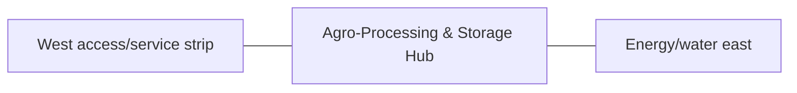

# Agro-Processing & Storage Hub — Space & Coordinates

## Parent allocation

- Area: **2,800 m²**
- Area in square feet: **30,139 ft²**
- Geometry: South-west service rectangle east of the access strip.
- L1 coordinate authority: **X 31.680–84.467 m; Y 12.828–65.871 m. L1 block ≈52.787 × 53.043 m.**

## Precision status

The outer zone placement is **PROVISIONAL L1** and must be preserved in all repository blueprints and images. Internal centimeter/mm positions are not yet approved unless explicitly documented here or in a dedicated subspace file.

## Space-budget rules

1. Sum all internal subspaces before approval.
2. Do not exceed the parent area.
3. Circulation, maintenance, drains, fire separation and buffers count as real area.
4. Shared utility corridors must be assigned to this zone or the 3,000 m² internal-access/buffer authority.
5. No uncounted "leftover" building may be inserted.

## Required internal functions

- crop receiving/drying
- grain storage
- rice milling
- feed milling
- oil pressing
- seed bank
- cold chain
- clean food handling
- workshop
- feed logistics

## Neighbor constraints

### Preferred / required neighbors
- West access/service strip
- Energy/water east
- Vegetables north
- Perimeter service road south

### Prohibited or controlled conflicts
- manure route through clean handling
- dust into cold/clean areas
- hot work near hay/grain dust
- uncontrolled oily drainage

## Diagram

