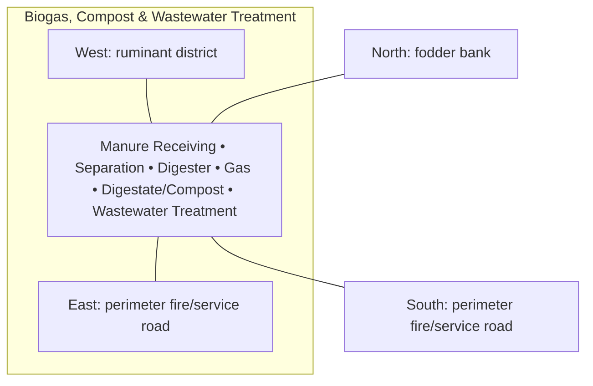

# Biogas, Compost & Wastewater Treatment — Architecture

## Architectural intent

Dirty-resource recovery endpoint: manure arrives from west, gas/compost/treated-water outputs leave only after controlled processing.

## Parent space authority

- **Area:** 1,600 m² / 17,222 ft²
- **Geometry:** far south-east treatment rectangle
- **L1 authority:** X 207.008–237.172 m; Y 12.828–65.871 m
- **Status:** parent placement is PROVISIONAL L1; internal partitions/coordinates remain PROVISIONAL until approved in a detailed plan

## Four-side context

| Side | What is beside this space |
|---|---|
| North | fodder bank |
| South | perimeter fire/service road |
| East | perimeter fire/service road |
| West | ruminant district |

## Internal architectural area schedule

The following is the current **non-overlapping internal planning budget**. It sums to the full parent area.

| Section / part | Area m² | Area ft² | Architectural purpose |
|---|---:|---:|---|
| Digester / main equipment | 300 | 3,229 | anaerobic digestion |
| Solids separation / equalization | 200 | 2,153 | feedstock pretreatment |
| Compost / digestate maturation | 450 | 4,844 | solid nutrient recovery |
| Wastewater treatment | 300 | 3,229 | liquid treatment |
| Gas handling / generator interface | 100 | 1,076 | gas storage/control interface |
| Service / safety buffer | 250 | 2,691 | access, separation and containment |
| **Total** | **1,600** | **17,222** | **parent space** |

## Architectural organization

1. **Manure Receiving**
2. **Separation**
3. **Digester**
4. **Gas**
5. **Digestate/Compost**
6. **Wastewater Treatment**

## Simple architecture diagram — not to scale

## Architecture rules

- All internal parts must fit inside the parent area; no "free" uncounted space.
- Access, drainage, maintenance, fire/biosecurity separation and utility clearances are part of architecture.
- Four-side neighboring context must stay correct in drawings and images.
- Permanent architecture must not move simply to improve an image composition.
- Structural dimensions, foundations, exact room/equipment positions and code-required clearances remain subject to L2/L3 engineering.

## Related files

- [Space & Coordinates](SPACE.md)
- [Blueprint](BLUEPRINT.md)
- [Design](DESIGN.md)
- [Image](IMAGE.md)
- [Drainage](DRAINAGE.md)
- [Water](WATER_SYSTEM.md)
- [Electrical](ELECTRICAL.md)
- [CCTV/Security](CCTV_SECURITY.md)
- [Lighting](LIGHTING.md)
- [Safety](SAFETY.md)
