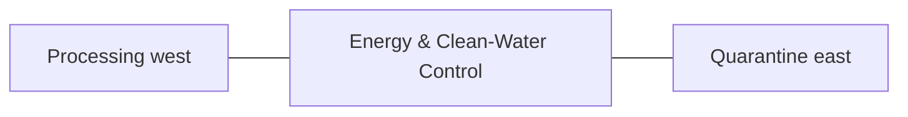

# Energy & Clean-Water Control — Architecture

## Architectural intent

Raised critical utility hub with physical separation between wet water-process spaces and electrical/battery spaces.

## L1 placement

X 84.467–99.549 m; Y 12.828–65.871 m. L1 block ≈15.082 × 53.043 m.

## Adjacency

- Processing west
- Quarantine east
- Perimeter service road south
- Vegetables north

## Spaces / functions inside this zone

- battery/inverter
- main electrical distribution
- water treatment
- pump controls
- monitoring
- critical utilities

## Architecture rules

- Keep the parent area at **800 m²**.
- Preserve clean/dirty traffic separation appropriate to this zone.
- Reserve maintenance and emergency access before adding decorative elements.
- Building footprints, internal partitions and exact equipment positions are **PROVISIONAL** until L2/L3 design.
- Any structure must respect flood, cyclone, fire, biosecurity and drainage requirements.

## Section relationship

## Cross references

- [Space budget](SPACE.md)
- [Design rules](DESIGN.md)
- [Utilities](UTILITIES.md)
- [Image rules](IMAGE.md)
