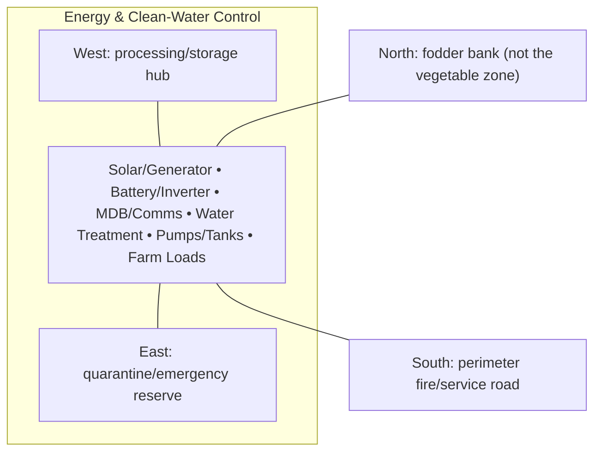

# Energy & Clean-Water Control — Architecture

## Architectural intent

Raised critical utility hub with wet water systems physically separated from electrical/battery rooms.

## Parent space authority

- **Area:** 800 m² / 8,611 ft²
- **Geometry:** south service utility rectangle
- **L1 authority:** X 84.467–99.549 m; Y 12.828–65.871 m
- **Status:** parent placement is PROVISIONAL L1; internal partitions/coordinates remain PROVISIONAL until approved in a detailed plan

## Four-side context

| Side | What is beside this space |
|---|---|
| North | fodder bank (not the vegetable zone) |
| South | perimeter fire/service road |
| East | quarantine/emergency reserve |
| West | processing/storage hub |

## Internal architectural area schedule

The following is the current **non-overlapping internal planning budget**. It sums to the full parent area.

| Section / part | Area m² | Area ft² | Architectural purpose |
|---|---:|---:|---|
| Battery / inverter room | 150 | 1,615 | electrical storage/conversion |
| Water treatment | 150 | 1,615 | clean-water processing |
| Pump / control area | 100 | 1,076 | water and utility control |
| Raw + treated water tanks | 120 | 1,292 | buffer storage |
| MDB / communications / monitoring | 80 | 861 | distribution and controls |
| Service / fire / maintenance buffer | 200 | 2,153 | clearances and safe access |
| **Total** | **800** | **8,611** | **parent space** |

## Architectural organization

1. **Solar/Generator**
2. **Battery/Inverter**
3. **MDB/Comms**
4. **Water Treatment**
5. **Pumps/Tanks**
6. **Farm Loads**

## Simple architecture diagram — not to scale

## Architecture rules

- All internal parts must fit inside the parent area; no "free" uncounted space.
- Access, drainage, maintenance, fire/biosecurity separation and utility clearances are part of architecture.
- Four-side neighboring context must stay correct in drawings and images.
- Permanent architecture must not move simply to improve an image composition.
- Structural dimensions, foundations, exact room/equipment positions and code-required clearances remain subject to L2/L3 engineering.

## Related files

- [Space & Coordinates](SPACE.md)
- [Blueprint](BLUEPRINT.md)
- [Design](DESIGN.md)
- [Image](IMAGE.md)
- [Drainage](DRAINAGE.md)
- [Water](WATER_SYSTEM.md)
- [Electrical](ELECTRICAL.md)
- [CCTV/Security](CCTV_SECURITY.md)
- [Lighting](LIGHTING.md)
- [Safety](SAFETY.md)
