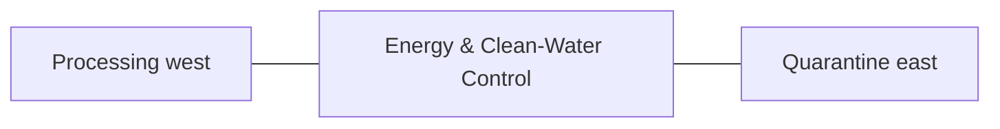

# Energy & Clean-Water Control — Space & Coordinates

## Parent allocation

- Area: **800 m²**
- Area in square feet: **8,611 ft²**
- Geometry: South service rectangle between processing and quarantine.
- L1 coordinate authority: **X 84.467–99.549 m; Y 12.828–65.871 m. L1 block ≈15.082 × 53.043 m.**

## Precision status

The outer zone placement is **PROVISIONAL L1** and must be preserved in all repository blueprints and images. Internal centimeter/mm positions are not yet approved unless explicitly documented here or in a dedicated subspace file.

## Space-budget rules

1. Sum all internal subspaces before approval.
2. Do not exceed the parent area.
3. Circulation, maintenance, drains, fire separation and buffers count as real area.
4. Shared utility corridors must be assigned to this zone or the 3,000 m² internal-access/buffer authority.
5. No uncounted "leftover" building may be inserted.

## Required internal functions

- battery/inverter
- main electrical distribution
- water treatment
- pump controls
- monitoring
- critical utilities

## Neighbor constraints

### Preferred / required neighbors
- Processing west
- Quarantine east
- Perimeter service road south
- Vegetables north

### Prohibited or controlled conflicts
- flood-prone low point
- wet electrical mixing
- manure concentration
- uncontrolled public access

## Diagram

