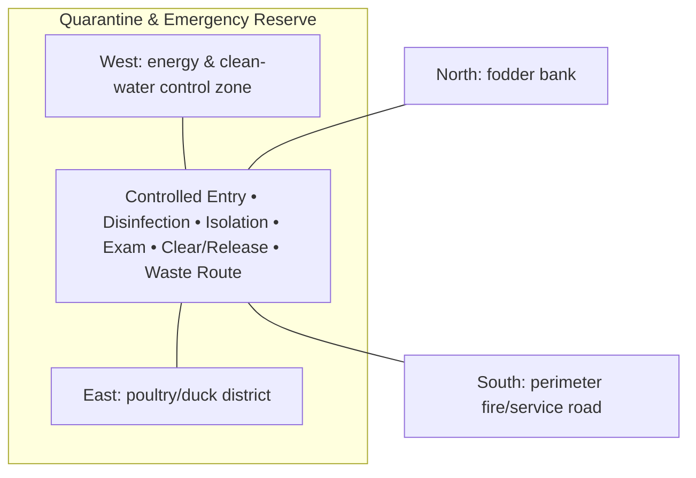

# Quarantine & Emergency Reserve — Architecture

## Architectural intent

Independent biosecure intake/isolation compound; new or suspect animals never flow directly into main production zones.

## Parent space authority

- **Area:** 1,000 m² / 10,764 ft²
- **Geometry:** south service isolation rectangle
- **L1 authority:** X 99.549–118.402 m; Y 12.828–65.871 m
- **Status:** parent placement is PROVISIONAL L1; internal partitions/coordinates remain PROVISIONAL until approved in a detailed plan

## Four-side context

| Side | What is beside this space |
|---|---|
| North | fodder bank |
| South | perimeter fire/service road |
| East | poultry/duck district |
| West | energy & clean-water control zone |

## Internal architectural area schedule

The following is the current **non-overlapping internal planning budget**. It sums to the full parent area.

| Section / part | Area m² | Area ft² | Architectural purpose |
|---|---:|---:|---|
| Controlled unloading / disinfection | 100 | 1,076 | new/suspect animal entry |
| Isolation pens | 300 | 3,229 | separate animal isolation |
| Exam / handling | 100 | 1,076 | health inspection |
| Feed / water support | 50 | 538 | dedicated supplies |
| Staff / PPE / hygiene | 50 | 538 | biosecurity support |
| Emergency storage | 100 | 1,076 | reserve supplies/equipment |
| Waste / drainage control | 100 | 1,076 | separate dirty route |
| Circulation / buffer | 200 | 2,153 | separation and access |
| **Total** | **1,000** | **10,764** | **parent space** |

## Architectural organization

1. **Controlled Entry**
2. **Disinfection**
3. **Isolation**
4. **Exam**
5. **Clear/Release**
6. **Waste Route**

## Simple architecture diagram — not to scale

## Architecture rules

- All internal parts must fit inside the parent area; no "free" uncounted space.
- Access, drainage, maintenance, fire/biosecurity separation and utility clearances are part of architecture.
- Four-side neighboring context must stay correct in drawings and images.
- Permanent architecture must not move simply to improve an image composition.
- Structural dimensions, foundations, exact room/equipment positions and code-required clearances remain subject to L2/L3 engineering.

## Related files

- [Space & Coordinates](SPACE.md)
- [Blueprint](BLUEPRINT.md)
- [Design](DESIGN.md)
- [Image](IMAGE.md)
- [Drainage](DRAINAGE.md)
- [Water](WATER_SYSTEM.md)
- [Electrical](ELECTRICAL.md)
- [CCTV/Security](CCTV_SECURITY.md)
- [Lighting](LIGHTING.md)
- [Safety](SAFETY.md)
