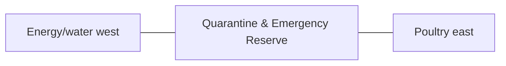

# Quarantine & Emergency Reserve — Architecture

## Architectural intent

Independent controlled-access buffer between clean utility/processing functions and main bird/livestock systems.

## L1 placement

X 99.549–118.402 m; Y 12.828–65.871 m. L1 block ≈18.852 × 53.043 m.

## Adjacency

- Energy/water west
- Poultry east
- Fodder north
- Perimeter service road south

## Spaces / functions inside this zone

- new-animal quarantine
- sick-animal isolation
- examination/handling
- disinfection
- emergency reserve

## Architecture rules

- Keep the parent area at **1,000 m²**.
- Preserve clean/dirty traffic separation appropriate to this zone.
- Reserve maintenance and emergency access before adding decorative elements.
- Building footprints, internal partitions and exact equipment positions are **PROVISIONAL** until L2/L3 design.
- Any structure must respect flood, cyclone, fire, biosecurity and drainage requirements.

## Section relationship

## Cross references

- [Space budget](SPACE.md)
- [Design rules](DESIGN.md)
- [Utilities](UTILITIES.md)
- [Image rules](IMAGE.md)
