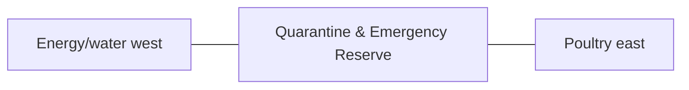

# Quarantine & Emergency Reserve

This folder is the detailed documentation authority for the **Quarantine & Emergency Reserve** space.

## At a glance

| Item | Value |
|---|---|
| Farm area allocation | **1,000 m² / 10,764 ft²** |
| L1 geometry | South service rectangle between energy/water and poultry. |
| L1 coordinate authority | X 99.549–118.402 m; Y 12.828–65.871 m. L1 block ≈18.852 × 53.043 m. |
| Status | **PROVISIONAL L1** — authoritative for repository drawings/images, not legal/construction staking |

## Purpose

- new-animal quarantine
- sick-animal isolation
- examination/handling
- disinfection
- emergency reserve

## Required skills

- [`eco-farm-quarantine-space`](../../.agents/skills/eco-farm-quarantine-space/SKILL.md)
- [`eco-farm-biosecurity-animal-health`](../../.agents/skills/eco-farm-biosecurity-animal-health/SKILL.md)
- [`eco-farm-security-resilience`](../../.agents/skills/eco-farm-security-resilience/SKILL.md)

## Folder documents

- [Architecture](ARCHITECTURE.md) — physical organization, adjacency and internal architecture
- [Space](SPACE.md) — area, coordinates, dimensions and subspace budget
- [Design](DESIGN.md) — design rules, safety, environmental and material concepts
- [Image](IMAGE.md) — blueprint/render/image-generation rules
- [Details](DETAILS.md) — complete component/interface description
- [Utilities](UTILITIES.md) — power, water, drainage, data, fire and waste interfaces
- [Operations](OPERATIONS.md) — operating routines, records and KPIs

## Neighbor relationship

## Must stay compatible with

- [`../../SPACE.md`](../../SPACE.md)
- [`../../docs/COORDINATE_MASTER_PLAN_L1.md`](../../docs/COORDINATE_MASTER_PLAN_L1.md)
- [`../../docs/SPACE_REGISTRY.md`](../../docs/SPACE_REGISTRY.md)
- [`../../docs/SPATIAL_DESIGN_STANDARD.md`](../../docs/SPATIAL_DESIGN_STANDARD.md)
- [`../../docs/IMAGE_BLUEPRINT_STANDARD.md`](../../docs/IMAGE_BLUEPRINT_STANDARD.md)
- [`../../docs/DECISIONS.md`](../../docs/DECISIONS.md)

Do not change this space's outer L1 authority without a master-plan decision and a full area/adjoining-system recheck.
