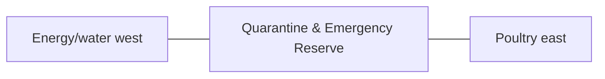

# Quarantine & Emergency Reserve — Space & Coordinates

## Parent allocation

- Area: **1,000 m²**
- Area in square feet: **10,764 ft²**
- Geometry: South service rectangle between energy/water and poultry.
- L1 coordinate authority: **X 99.549–118.402 m; Y 12.828–65.871 m. L1 block ≈18.852 × 53.043 m.**

## Precision status

The outer zone placement is **PROVISIONAL L1** and must be preserved in all repository blueprints and images. Internal centimeter/mm positions are not yet approved unless explicitly documented here or in a dedicated subspace file.

## Space-budget rules

1. Sum all internal subspaces before approval.
2. Do not exceed the parent area.
3. Circulation, maintenance, drains, fire separation and buffers count as real area.
4. Shared utility corridors must be assigned to this zone or the 3,000 m² internal-access/buffer authority.
5. No uncounted "leftover" building may be inserted.

## Required internal functions

- new-animal quarantine
- sick-animal isolation
- examination/handling
- disinfection
- emergency reserve

## Neighbor constraints

### Preferred / required neighbors
- Energy/water west
- Poultry east
- Fodder north
- Perimeter service road south

### Prohibited or controlled conflicts
- main herd direct mixing
- clean family route
- shared dirty tools
- uncontrolled drainage

## Diagram

