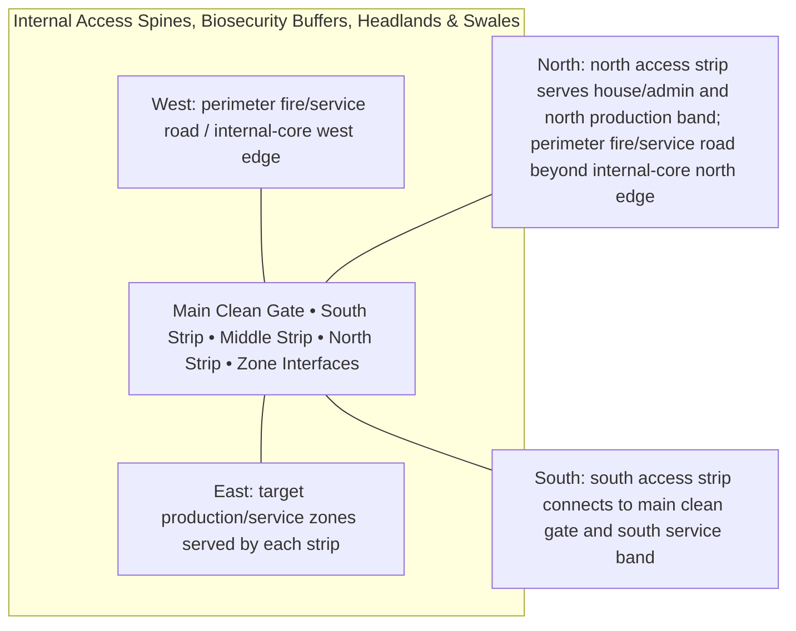

# Internal Access Spines, Biosecurity Buffers, Headlands & Swales — Architecture

## Architectural intent

Distributed operational infrastructure, not leftover land. Each strip carries access, swales, utilities, turning and separation inside its fixed 1,000 m² budget.

## Parent space authority

- **Area:** 3,000 m² / 32,292 ft²
- **Geometry:** three distributed west-side strips plus internal functional corridors
- **L1 authority:** south strip X12.828–31.680 Y12.828–65.871; middle strip X12.828–25.648 Y65.871–143.877; north strip X12.828–28.627 Y143.877–207.172
- **Status:** parent placement is PROVISIONAL L1; internal partitions/coordinates remain PROVISIONAL until approved in a detailed plan

## Four-side context

| Side | What is beside this space |
|---|---|
| North | north access strip serves house/admin and north production band; perimeter fire/service road beyond internal-core north edge |
| South | south access strip connects to main clean gate and south service band |
| East | target production/service zones served by each strip |
| West | perimeter fire/service road / internal-core west edge |

## Internal architectural area schedule

The following is the current **non-overlapping internal planning budget**. It sums to the full parent area.

| Section / part | Area m² | Area ft² | Architectural purpose |
|---|---:|---:|---|
| South access/buffer strip | 1,000 | 10,764 | processing/service-band access and swales |
| Middle access/buffer strip | 1,000 | 10,764 | vegetable/fodder-band access and swales |
| North access/buffer strip | 1,000 | 10,764 | house/crop-band access and swales |
| **Total** | **3,000** | **32,292** | **parent space** |

## Architectural organization

1. **Main Clean Gate**
2. **South Strip**
3. **Middle Strip**
4. **North Strip**
5. **Zone Interfaces**

## Simple architecture diagram — not to scale

## Architecture rules

- All internal parts must fit inside the parent area; no "free" uncounted space.
- Access, drainage, maintenance, fire/biosecurity separation and utility clearances are part of architecture.
- Four-side neighboring context must stay correct in drawings and images.
- Permanent architecture must not move simply to improve an image composition.
- Structural dimensions, foundations, exact room/equipment positions and code-required clearances remain subject to L2/L3 engineering.

## Related files

- [Space & Coordinates](SPACE.md)
- [Blueprint](BLUEPRINT.md)
- [Design](DESIGN.md)
- [Image](IMAGE.md)
- [Drainage](DRAINAGE.md)
- [Water](WATER_SYSTEM.md)
- [Electrical](ELECTRICAL.md)
- [CCTV/Security](CCTV_SECURITY.md)
- [Lighting](LIGHTING.md)
- [Safety](SAFETY.md)
